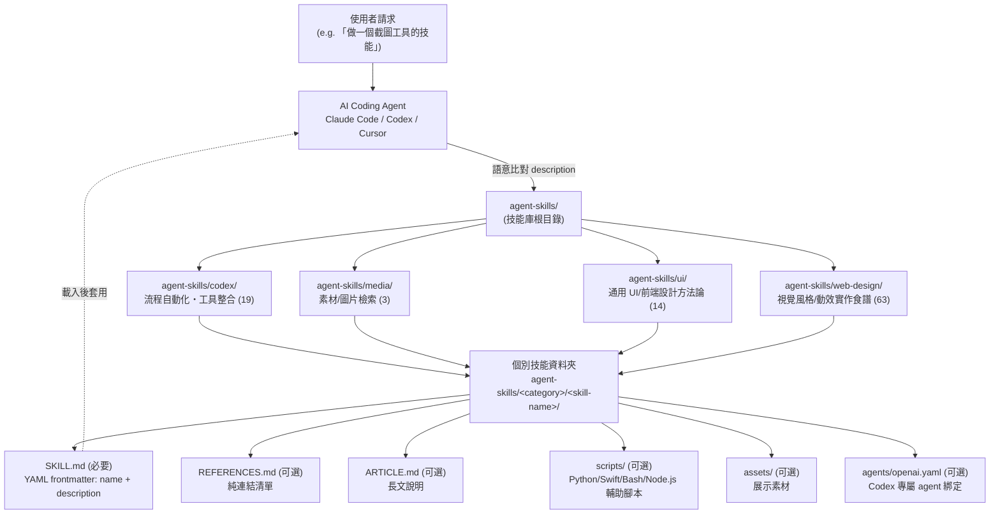
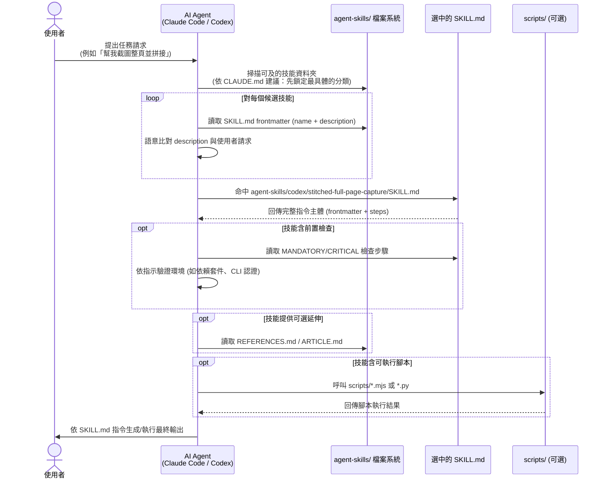

# ARCHITECTURE.md — MengTo/Skills 內容庫架構

> ⚠️ 前置說明：本 repo（`MengTo/Skills`）**不是傳統軟體專案**，而是一個 AgentSkills 內容庫——120 個 Markdown 檔案組成約 99 個技能資料夾，供 Codex / Claude Code / Cursor 等 AI coding agent 動態載入使用。沒有 server、沒有資料庫、沒有 build/CI。因此本文件中的「架構」指**內容庫的組織架構**與**技能發現/組合機制**，「元件」指分類目錄與技能資料夾，「通訊模式」指 agent 的語意路由行為，而非傳統的 process 間通訊。所有結論來自對 `agent-skills/` 目錄與 `CLAUDE.md`、`README.md` 的直接觀察；標記 ⚠️ 未驗證 的項目在 repo 內找不到明文依據。

## 1. 高層架構

repo 只有一層「應用邏輯」：資料夾契約（folder contract）。使用者的 agent（Claude Code / Codex / Cursor）在執行任務時，掃描 `agent-skills/` 下四個分類目錄，透過語意比對技能的 `description` frontmatter 找到候選技能，讀入其 `SKILL.md`（可選再讀 `REFERENCES.md`/`ARTICLE.md`/`scripts/`），將其內容當作 system/context 注入後續生成。

## 2. 元件清單

| 名稱 | 職責 | 關鍵檔案/目錄 | 上游依賴 | 下游依賴 |
|------|------|---------------|---------|---------|
| repo 根治理層 | 定義資料夾契約、風格守則、安全守則、工作流程建議 | `CLAUDE.md:1-52`, `README.md` | 無 | 所有分類目錄與技能作者遵循此契約 |
| `agent-skills/codex/` 分類 | 流程自動化 / 工具整合，多含可執行腳本 | 19 個技能資料夾，如 `agent-skills/codex/screenshot/scripts/`, `agent-skills/codex/elevenlabs-tts/SKILL.md:3` | 遵循根目錄資料夾契約 | Codex agent 執行時載入；部分技能依賴外部 CLI/API（Netlify CLI、ElevenLabs API） |
| `agent-skills/media/` 分類 | 素材/圖片檢索類技能（查詢詞 → 對的圖） | 3 個技能資料夾，如 `agent-skills/media/unsplash-asset-images/SKILL.md:3` | 資料夾契約 | 依賴外部圖庫 API（Unsplash 等） |
| `agent-skills/ui/` 分類 | 通用、跨技術棧的設計方法論與品味規則 | 14 個技能，如 `agent-skills/ui/design-taste-frontend/SKILL.md:5-32`, `agent-skills/ui/frontend-design/SKILL.md:9-13` | 資料夾契約 | 常被 `web-design/` 下具體風格技能引用/搭配使用（非強制連結，屬慣例組合） |
| `agent-skills/web-design/` 分類 | 高度具體的單一視覺效果/風格系統實作食譜（60+ 種風格） | 63 個技能，`agent-skills/web-design/README.md`, `agent-skills/web-design/WEB-DESIGN-SKILLS.md` | 資料夾契約；通常搭配 `ui/` 的方法論 | 依賴外部前端庫文件（GSAP、Three.js 等），透過 `REFERENCES.md` 連結 |
| `SKILL.md`（技能單元） | 唯一必要檔案；YAML frontmatter 承擔路由職責 + 步驟化指令主體 | 每技能資料夾下 1 份，如 `agent-skills/ui/full-output-enforcement/SKILL.md:1-4` | 無強制上游 | agent 讀取後直接作為執行 context |
| `REFERENCES.md` | 純連結清單，指向官方文件 | 可選，各技能資料夾內 | `SKILL.md` 內容延伸 | 不參與路由，僅供 agent/人類延伸閱讀 |
| `scripts/` | 技能的可執行輔助腳本（截圖、TTS、頁面拼接等） | 如 `agent-skills/codex/screenshot/scripts/*.swift,*.py,*.ps1,*.sh`, `agent-skills/codex/stitched-full-page-capture/scripts/*.mjs` | `SKILL.md` 指示呼叫時機 | 依賴對應執行環境（macOS/Windows/Node.js） |
| `agents/openai.yaml` | Codex 專屬技能的 agent 綁定設定 | 多數為空或極簡 ⚠️ 未驗證 schema 規格 | `SKILL.md` | Codex 執行時讀取（推測，⚠️ 未驗證實際消費方式） |
| 人類分類索引 | 輔助入口，供人類手動瀏覽選擇 | `README.md:9-20`（4 個 flagship 技能）, `agent-skills/web-design/WEB-DESIGN-SKILLS.md` | 手動維護，非強制索引 | 無程式化下游，僅供閱讀 |

## 3. 分層設計與 module boundary

四個分類目錄不是靠程式碼強制分層，而是靠**命名慣例 + 內容性質**自然劃出邊界：

- **`codex/`**：流程/工具邊界。技能多半對應一個可重複執行的自動化任務（截圖、部署、TTS、影片轉 prompt），較少涉及美學判斷，因此是唯一大量夾帶 `scripts/` 可執行檔的分類（`core_logic.md` 觀察）。
- **`media/`**：素材檢索邊界。核心邏輯是「用查詢詞找到對的圖」，範圍最小（僅 3 個技能），不涉及生成邏輯。
- **`ui/`**：方法論邊界。內容是「跨技術棧的通用設計品味規則」，例如把主觀審美量化為 1-10 knob（`agent-skills/ui/design-taste-frontend/SKILL.md:5-8`）與強制字體白名單（`agent-skills/ui/design-taste-frontend/SKILL.md:29-32`）。此分類技能不綁定任何特定視覺風格，可被 `web-design/` 下的具體風格技能共同引用。
- **`web-design/`**：實作食譜邊界。每個技能鎖定一種明確的視覺風格或效果系統（如 `dark-glass-clean-layout/`、`solar-duotone-bold/`、`industrial-brutalist-ui/`），本質上是同一個「生成網頁 UI」任務的不同 strategy 實作（`core_logic.md:26`）。這是規模最大的分類（63 個），且是唯一附帶 `README.md`/`WEB-DESIGN-SKILLS.md` 自我聲明「draft，待完成」的子集（`recon.md:23`）。

邊界並非由任何 lint/CI 強制——完全依賴技能作者遵循 `CLAUDE.md:12-22` 的資料夾契約與人工判斷該歸入哪個分類。目前**無明文規則規定「何時該開新分類 vs 塞進既有分類」**（`extensions.md:27`，⚠️ 未驗證，屬慣例而非強制規範）。

## 4. 通訊模式：隱式語意路由（非傳統 IPC/pub-sub）

這裡沒有訊息佇列、沒有 event bus、沒有 RPC。「路由」發生在 agent 的 prompt 理解層，而非 repo 程式碼層。共有三種入口路徑（`entry_points.md`）：

1. **明文引用入口**：下游專案的 `CLAUDE.md` 直接寫死路徑（例如引用 `agent-skills/ui/frontend-design/SKILL.md`），Claude Code 啟動時原樣讀入作為 working context。無需搜尋，等同 hardcoded import。
2. **Frontmatter 語意比對入口**：每個 `SKILL.md` 的 YAML frontmatter `description` 欄位刻意寫成「使用時機」句型（例如 `agent-skills/codex/elevenlabs-tts/SKILL.md:3`："Use when the user asks for ElevenLabs, text-to-speech, TTS, narration..."）。Agent（尤其 Codex）在任務開始前，將使用者請求與可及技能的 `description` 做語意比對，決定載入哪一個——這是 **RAG-lite 式的 self-selection**，比對邏輯完全存在於 agent 的語言理解能力中，repo 內沒有任何程式化的 index/embedding 檔案支撐。
3. **分類瀏覽入口**：`README.md:9-20` 與 `agent-skills/web-design/WEB-DESIGN-SKILLS.md` 是給人類看的手動索引，非 agent 執行時的必要路徑。

沒有中央 registry 列舉全部 99 個技能供程式化查詢；`README.md` 僅手動列出少數 flagship 技能（`entry_points.md:32`）。

### 4.1 技能生命週期 sequence diagram

## 5. 關鍵設計決策與 trade-off

| 決策 | 理由 | Trade-off |
|------|------|-----------|
| 用**資料夾契約**取代中央 registry（`CLAUDE.md:12-22`） | 新增技能是零副作用操作——不需修改任何既有檔案、不需註冊清單，符合「Keep changes small」守則（`extensions.md:16`） | 沒有程式化的技能總覽/查詢介面；`README.md` 的清單是手動維護，容易與實際目錄產生落差（`recon.md:24` 已觀察到 `WEB-DESIGN-SKILLS.md` 與實際目錄數量不一致） |
| 用 **frontmatter `description` 承擔路由職責**，而非關鍵字 tag 系統或 embedding index | 讓路由邏輯完全交給 agent 的自然語言理解能力，作者只需寫清楚「使用時機」句型即可，維護成本低（純文字，無需額外 build 步驟） | 路由品質完全依賴 agent 當下的語意比對能力與可見的技能範圍（context window），無法保證「最佳」技能一定被選中；也無法做離線的路由正確性測試 |
| 四個分類目錄採**扁平命名慣例**而非強制 schema/lint | 保持內容庫足夠輕量，符合純 Markdown、無需 build 的定位 | 分類邊界依賴人工判斷，`ui/` 與 `web-design/` 的界線（方法論 vs 具體風格食譜）僅靠慣例維持，未來新增分類（如 `backend/`）的判準不明（`extensions.md:27`，⚠️ 未驗證） |
| 用**量化 knob + 強制規則**取代模糊審美建議（`agent-skills/ui/design-taste-frontend/SKILL.md:5-32`） | 直接反制 LLM 生成 UI 的已知統計偏誤（如預設用 `Inter` 字體、風格趨於中庸的「AI slop」），給 agent 可調參數而非自由發揮空間（`core_logic.md:17-24`） | 犧牲部分靈活性；技能作者需要持續維護「已知偏誤清單」，若 LLM 底層行為改變，規則可能過時 |
| `scripts/` 為**可選附屬**而非獨立技能 | 同一技能可用多個平台變體腳本擴充（如 `screenshot/scripts/` 內 5 個平台專屬腳本），不必拆成多個技能資料夾（`extensions.md:32`） | 技能資料夾內同時混雜「文件」與「可執行程式碼」，兩種截然不同性質的內容共享一個 folder contract，對純內容庫定位造成局部例外 |
| 技能間**鏈式組合靠人工編排**而非 pipeline/middleware 機制 | `README.md:9-19` 展示的 4 步驟 flagship workflow（`video-to-superprompt` → `html-to-interaction-prompts` → `stitched-full-page-capture` → `daily-ui-inspiration-capture`）证明可組合而不需建立「複合技能」，維持每個技能單一職責（`extensions.md:37`） | 沒有程式化的 pipeline 定義檔，組合順序與依賴關係僅存在於 `README.md` 敘述中，agent 需自行理解並依序調用 |

## 6. 已知落差與未驗證項目彙總

- ⚠️ `agent-skills/web-design/WEB-DESIGN-SKILLS.md` 的技能清單與實際目錄內容有落差（詳見 `DISCOVERY_LOG.md`，本文件未展開）。
- ⚠️ `agents/openai.yaml` 的實際 schema 規格與消費方式，repo 內未見官方說明文件。
- ⚠️ 「何時該開新分類 vs 塞進既有分類」目前無明文治理規則，僅為觀察到的慣例。
- ⚠️ Codex 如何具體執行 `description` 語意比對（例如是否有 embedding、是否受限於單次可載入技能數量）不在 repo 內可見，僅能從行為慣例推論。
