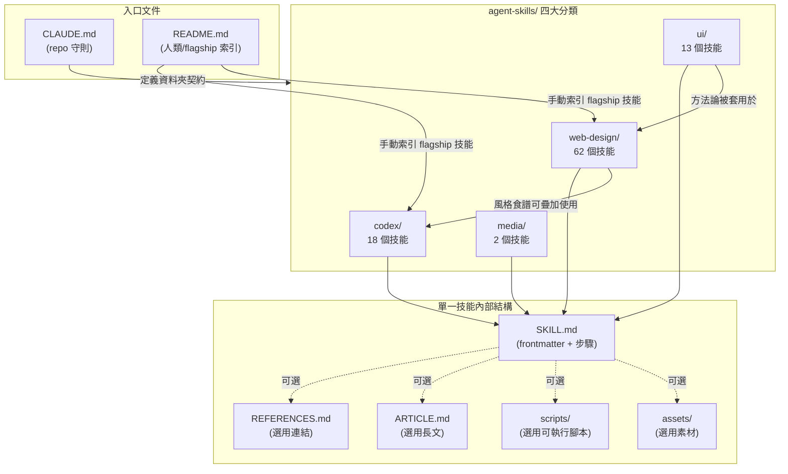

# CODEBASE_MAP — 程式碼（內容）地圖

## Annotated Directory Tree

```
.
├── CLAUDE.md                        # repo 全域守則：資料夾契約、風格、安全守則
├── README.md                        # 人類讀者入口：專案目的、agent 整合方式、flagship workflow
├── LICENSE
├── assets/                          # README 展示用素材（gif 等）
└── agent-skills/                    # 所有技能的根目錄
    ├── codex/                       # 18 個技能，流程自動化/工具整合類，多含可執行 scripts/
    │   ├── screenshot/scripts/      # 平台特定截圖腳本（macOS/Windows）
    │   ├── elevenlabs-tts/scripts/  # TTS 生成腳本（Python）
    │   ├── playwright/, playwright-interactive/   # 瀏覽器自動化
    │   ├── netlify-deploy/          # 部署技能
    │   └── ...（其餘多為純 Markdown 流程指南）
    ├── media/                       # 2 個技能，素材檢索類
    │   ├── unsplash-asset-images/   # Unsplash 圖片檢索
    │   └── aura-asset-images/       # Aura Build Assets 圖片檢索
    ├── ui/                          # 13 個技能，通用 UI/前端設計方法論
    │   ├── design-taste-frontend/   # 量化設計品味（DESIGN_VARIANCE 等旋鈕）
    │   ├── frontend-design/         # 生成高品質前端介面的方法論
    │   ├── high-end-visual-design/, minimalist-ui/, industrial-brutalist-ui/, gpt-taste/ ...
    └── web-design/                  # 62 個技能，最大子集，具體視覺風格/動效系統食譜
        ├── README.md, WEB-DESIGN-SKILLS.md   # 子集內部索引文件
        ├── gsap/, tailwindcss/, globe-gl/, matterjs/   # 技術庫特定實作指南
        └── dark-glass-clean-layout/, solar-duotone-bold/, ...  # 視覺風格系統（以風格命名）
```

## 「我想要...」速查表

| 我想要... | 看這裡 | 關鍵檔案 |
|-----------|--------|---------|
| 新增一個技能 | `agent-skills/<category>/<new-skill-name>/` | `SKILL.md`（必要），參考 `CLAUDE.md:12-19` 資料夾契約 |
| 了解技能撰寫風格規範 | 根目錄 | `CLAUDE.md`（Style / Safety 章節） |
| 找一個處理「設計品味/UI 生成」的技能 | `agent-skills/ui/` | `design-taste-frontend/SKILL.md`、`frontend-design/SKILL.md` |
| 找一個特定視覺風格的實作食譜 | `agent-skills/web-design/` | 依風格命名的資料夾，如 `dark-glass-clean-layout/SKILL.md` |
| 找一個動效/3D 函式庫用法 | `agent-skills/web-design/` | `gsap/`、`matterjs/`、`globe-gl/`、`tailwindcss/` |
| 找一個素材檢索技能 | `agent-skills/media/` | `unsplash-asset-images/SKILL.md`、`aura-asset-images/SKILL.md` |
| 找一個部署/自動化流程技能 | `agent-skills/codex/` | `netlify-deploy/SKILL.md`、`playwright/SKILL.md` |
| 幫技能補充延伸閱讀連結 | 該技能資料夾內 | `REFERENCES.md`（只放連結，見 `CLAUDE.md:22`） |
| 幫技能加可執行輔助腳本 | 該技能資料夾內 | 新建 `scripts/`，參考 `agent-skills/codex/screenshot/scripts/` 的既有模式 |
| 了解整體 repo 目的/哲學 | 根目錄 | `README.md`（"Prompts are assets" 哲學章節） |

## 模組依賴關係圖



**依賴方向說明**：`ui/` 的通用方法論（如 `design-taste-frontend/` 的量化品味旋鈕）在概念上會被 `web-design/` 的具體風格技能所遵循，但兩者之間**沒有程式化的 import/reference**——這條「依賴」是 agent 在同時載入多個技能時於執行期自行疊加的語意關係，非檔案層級的硬連結。詳見 `.trace/ARCHITECTURE.md`。
