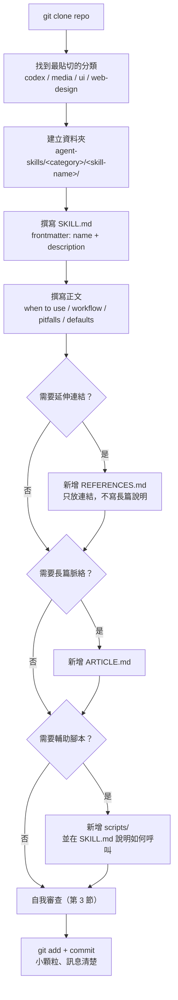

# DEV_GUIDE — 貢獻者上手指南

> ⚠️ 本 repo 是一個 **AgentSkills 內容庫**（見 `.trace/_context/recon.md`），不是傳統軟體專案。沒有 build/compile/run 流程，沒有測試框架，沒有 CI/CD。「開發」在此脈絡下指**撰寫與維護 Markdown 技能檔案**。本指南依此性質調整原 DEV_GUIDE 規格的各章節。

## 目錄
1. [Prerequisites 與環境建置](#1-prerequisites-與環境建置)
2. [本地開發 Workflow：新增一個技能](#2-本地開發-workflow新增一個技能)
3. [驗證新技能品質（測試策略的置換）](#3-驗證新技能品質測試策略的置換)
4. [技能未被觸發時的除錯思路](#4-技能未被觸發時的除錯思路)
5. [Contribution Workflow](#5-contribution-workflow)
6. [相依性管理](#6-相依性管理)

---

## 1. Prerequisites 與環境建置

大多數貢獻只需要 **git** 和一個文字編輯器。

```bash
git clone https://github.com/MengTo/Skills.git
cd Skills
```

沒有 `package.json`、`pyproject.toml`、`Cargo.toml`、`Dockerfile`，也沒有 `.env.example`（見 `.trace/_context/recon.md` 第 17 行）。你不需要安裝任何套件管理器或 runtime 就能新增、修改、閱讀技能檔案。

### 例外：少數技能含輔助腳本

`agent-skills/codex/` 底下有 8 個非 Markdown 腳本檔案，分屬 3 個技能。只有在你要**執行或修改這些腳本本身**（而不只是編輯 `SKILL.md`）時，才需要對應環境：

| 技能 | 腳本 | 需要環境 |
|------|------|---------|
| `agent-skills/codex/elevenlabs-tts/` | `scripts/generate_voice.py` | Python 3 + ElevenLabs API key（環境變數 `ELEVENLABS_API_KEY` 或最近的 `.env`，見 `SKILL.md:9`） |
| `agent-skills/codex/screenshot/` | `scripts/take_screenshot.py`、`scripts/take_screenshot.ps1`、`scripts/macos_permissions.swift`、`scripts/macos_window_info.swift`、`scripts/macos_display_info.swift`、`scripts/ensure_macos_permissions.sh` | Python 3（跨平台版）或 Swift/macOS 系統權限（macOS 版）或 PowerShell（Windows 版），依平台擇一 |
| `agent-skills/codex/playwright/` | `scripts/playwright_cli.sh` | Playwright 本地安裝（瀏覽器自動化，無外部帳號） |
| `agent-skills/codex/stitched-full-page-capture/` | `scripts/stitch_full_page_capture.mjs` | Node.js（`.mjs`） |
| `agent-skills/codex/netlify-deploy/` | 無獨立腳本，依賴 CLI | Netlify CLI（`npx netlify`），需已登入的 CLI session |

⚠️ 未驗證：各腳本的確切版本需求（如 Python/Node 最低版本）未在 `SKILL.md` 中標注，需讀腳本原始碼確認。絕大多數貢獻者（撰寫/編輯純 Markdown 技能）可以完全略過本節。

---

## 2. 本地開發 Workflow：新增一個技能

依 `CLAUDE.md:12-22` 與 `README.md:208-230` 的資料夾契約，完整流程如下：



### Step 1 — 選分類、建資料夾

現有四大分類（見 `.trace/_context/recon.md` 第 36-60 行）：

- `agent-skills/codex/` — Codex 專屬操作型技能（多含 `scripts/`、`agents/openai.yaml`）
- `agent-skills/media/` — 素材／圖片來源類技能
- `agent-skills/ui/` — UI/前端設計方法論
- `agent-skills/web-design/` — 網頁視覺、動效、3D、版型系統（目前最大子集）

建立資料夾：

```bash
mkdir -p agent-skills/<category>/<skill-name>
```

命名慣例：kebab-case，語意清楚（例如 `progressive-blur`、`gsap-scrolltrigger-storytelling`）。

### Step 2 — 撰寫 `SKILL.md`（必要檔案）

frontmatter 只有兩個欄位，但這是全庫唯一一致遵守的結構化 schema（見 `.trace/_context/configuration.md` 第 20 行：95/95 個檔案皆有）：

```yaml
---
name: your-skill-name
description: Use when the user asks for X, Y, Z...
---
```

- `name`：與資料夾名一致。
- `description`：**這是技能的「路由設定」**（見第 4 節）。務必寫成「使用時機」句型，例如 `agent-skills/codex/elevenlabs-tts/SKILL.md:3`："Use when the user asks for ElevenLabs, text-to-speech, TTS, narration..."。

正文建議包含：
- when to use（觸發情境，可與 description 呼應但更詳細）
- workflow（步驟化流程）
- pitfalls（常見錯誤）
- defaults / constraints（具體數值：時長、間距、層級——呼應 `CLAUDE.md:31`）

參考範例：`agent-skills/ui/design-taste-frontend/SKILL.md:5-7` 定義了 `DESIGN_VARIANCE`、`MOTION_INTENSITY`、`VISUAL_DENSITY` 三個數值旋鈕，並註明「不要要求使用者編輯此檔案，依使用者明確要求動態調整這些數值」——這是把「預設值 + 可覆寫」直接寫進正文的具體做法。

### Step 3 — （可選）`REFERENCES.md`

**只放連結，不寫長篇解釋**（`CLAUDE.md:22`、`CLAUDE.md:26`）。目的是讓 `SKILL.md` 保持精簡，延伸閱讀另外歸檔。

### Step 4 — （可選）`ARTICLE.md`

長篇脈絡、設計理念、案例分析放這裡，不放進 `SKILL.md`（`README.md:238`）。

### Step 5 — （可選）`assets/`、`scripts/`

- `assets/`：圖片、範本、範例檔案。
- `scripts/`：輔助腳本。若新增腳本，**必須**在 `SKILL.md` 中說明呼叫方式、所需環境變數／認證（依循第 6 節的外部化設定原則，不得把 API key 寫死在腳本或 skill 裡）。

### Step 6 — 自我審查與 commit

見第 3 節「驗證」與第 5 節「commit 慣例」。

---

## 3. 驗證新技能品質（測試策略的置換）

⚠️ **本 repo 目前沒有任何自動化 lint 或 test 工具驗證技能格式**（無 CI/CD workflow，見 `.trace/_context/recon.md` 第 17、74 行）。`README.md:247` 甚至把「Add lightweight validation for required frontmatter」列為未來的 maintenance idea，代表截至目前仍是**純人工審查**。

貢獻新技能前，請對照以下 checklist 自我審查（依 `CLAUDE.md` Style 守則與 `README.md:220-225` 的技能契約 checklist）：

- [ ] **Frontmatter 完整**：`name` 與資料夾名一致；`description` 存在且非空。
- [ ] **description 可被語意比對觸發**：是否明確寫出「使用時機」（"Use when..."），而非模糊的功能描述？是否包含使用者實際會說出口的關鍵字（工具名、任務類型、常見詞彙）？
- [ ] **正文 skimmable**：是否用條列、標題、步驟分段，而非大段連續文字？（呼應 `CLAUDE.md:21`）
- [ ] **具體 constraints/defaults**：是否給出可直接複製貼上的具體數值或指令，而非空泛建議？（呼應 `CLAUDE.md:23`：「Prefer constraints and defaults (durations, spacing, hierarchy)」）
- [ ] **procedural，非百科式**：內容是步驟/recipe/guardrail，不是長篇說明文（長說明應移至 `ARTICLE.md`）。
- [ ] **REFERENCES.md 只有連結**：沒有夾雜大段解釋文字。
- [ ] **無 secrets／私人資訊**：沒有 API key、token、真實客戶資料（`CLAUDE.md:26-28`）。
- [ ] **可攜性（portable by default）**：技能對任何使用者/repo/workspace 都成立，不預設特定帳號、特定專案路徑（`README.md:22`、`README.md:248`）。

由於沒有自動化工具，建議的「人工測試」方式是：把新的 `SKILL.md` 貼進一個乾淨的 agent session，用幾個貼近真實使用情境的 prompt 測試該技能是否會被正確載入、以及載入後 agent 是否確實照著步驟執行——這是目前最接近「跑測試」的作法，但完全依賴貢獻者主動執行，非強制流程。

---

## 4. 技能未被觸發時的除錯思路

技能沒有中央 dispatcher，「路由」完全依賴 agent 對 `description` frontmatter 做語意比對後自行選擇載入哪個技能（見 `.trace/_context/entry_points.md` 第 17-32 行，稱為「隱式路由」）。若技能沒被正確觸發，依序檢查：

1. **description 是否夠具體**
   - 是否用了「Use when...」句型明確列出觸發情境？
   - 是否包含使用者請求中會出現的具體詞彙（工具名、任務動詞、格式名稱）？含糊的描述（如「Helps with design」）幾乎不會被語意比對命中。

2. **是否與其他技能語意衝突**
   - `agent-skills/web-design/` 目前有 63 個技能，其中「視覺風格與頁面氛圍」類（如 `dark-glass-clean-layout`、`glass-dark-ui`、`mesh-gradient-dark-blue-clean`）彼此描述高度相近，容易互相搶觸發。新增此類技能前，先搜尋既有同分類技能的 description，確認差異化夠明確。
   - 檢查方式：`grep -r "description:" agent-skills/web-design/*/SKILL.md` 或針對目標分類目錄比對，找出用詞重疊的技能。

3. **description 與正文是否脫節**
   - description 承諾的使用情境，正文是否真的涵蓋？agent 有時會依 description 載入技能，卻在正文找不到對應步驟，導致執行走樣。

4. **是否放對分類目錄**
   - 明文引用入口（見 `.trace/_context/entry_points.md` 第 5-15 行）常見於下游專案 `CLAUDE.md` 直接寫死路徑（例如 `agent-skills/ui/frontend-design/SKILL.md`）。若技能放錯分類，明文引用會直接失效。

5. **人工分類索引是否過時**
   - `agent-skills/web-design/WEB-DESIGN-SKILLS.md` 與 `README.md` 的技能清單是手動維護的輔助入口，非 agent 執行必要路徑，但若你新增技能後忘記更新這些索引，人類瀏覽者（而非 agent）會找不到它。⚠️ 已知落差：`.trace/_context/recon.md` 第 24 行標注 `WEB-DESIGN-SKILLS.md` 內容與實際目錄數量有落差，屬既有問題非本次新增。

---

## 5. Contribution Workflow

### 分支模型

⚠️ 未驗證：本 repo 是 Meng To 的個人 GitHub 專案（見 `.trace/_context/web_findings.md` 第 5-10 行），未發現正式的 PR review 流程文件（無 `CODEOWNERS`、無 `.github/PULL_REQUEST_TEMPLATE`、無 branch protection 相關文件）。從實際 commit 歷史看，多數提交直接落在 `main`（如 `git log` 顯示的線性歷史），推測採**輕量治理**：小顆粒 commit、直接推送或簡單 PR，無強制多人 review 關卡。若要貢獻，穩妥做法仍是開 PR 讓維護者有機會過目，而非強制假設可直接 push。

### Commit 訊息慣例

依 `README.md:227-229` 與實際歷史（`Add <skill-name> skill`、`Update <skill-name> skill`、`Sync reusable skills`）：

- 一個技能一次 commit，保持顆粒度小。
- 新增技能：`Add <skill-name> skill`
- 修改既有技能：`Update <skill-name> skill`
- 訊息清楚描述「做了什麼」，不需要 body 長篇解釋（本庫本身就是內容庫，commit 訊息也遵循同樣的 skimmable 精神）。

### 建議流程

1. `git clone` → 建立技能資料夾（見第 2 節）。
2. 完成 checklist（見第 3 節）自我審查。
3. 小顆粒 commit。
4. 若更新了 `web-design/` 分類，順手檢查 `agent-skills/web-design/WEB-DESIGN-SKILLS.md` 與根 `README.md` 的技能清單／計數是否需要同步更新（`README.md:245`：「Keep category README files current as the library grows」）。
5. Push / 開 PR。

---

## 6. 相依性管理

本 repo **沒有中央依賴管理系統**（無單一語言的 package manifest，見 `.trace/_context/recon.md` 第 75 行）。相依性完全分散在個別技能的 `scripts/` 內，各自宣告所需工具：

| 技能 | 依賴 | 宣告位置 |
|------|------|---------|
| `agent-skills/codex/netlify-deploy/` | Netlify CLI（透過 `npx netlify`） | `SKILL.md:14-18`，需先跑 `netlify status` 確認已登入 |
| `agent-skills/codex/elevenlabs-tts/` | ElevenLabs TTS API；`ELEVENLABS_API_KEY` 環境變數或最近的 `.env` | `SKILL.md:9`；`SKILL.md:5-8` 明確禁止把 key/voice id/帳號資訊寫進技能本身 |
| `agent-skills/codex/playwright/`、`agent-skills/codex/playwright-interactive/` | Playwright（本地安裝，無外部帳號） | `scripts/playwright_cli.sh` |
| `agent-skills/codex/stitched-full-page-capture/` | Node.js（執行 `.mjs`） | `scripts/stitch_full_page_capture.mjs` |
| `agent-skills/codex/screenshot/` | macOS/Windows 系統層級 API 存取權限 | `scripts/ensure_macos_permissions.sh` 負責確保權限就緒，缺權限時提示使用者手動授權（非靜默失敗） |
| `agent-skills/media/unsplash-asset-images/` | 無（唯讀，僅產出 Unsplash 頁面連結，非 API 呼叫） | — |
| `agent-skills/media/aura-asset-images/` | 無（唯讀，公開搜尋 URL query） | — |

治理原則（`.trace/_context/integrations.md` 第 17-25 行）：任何需要憑證的技能一律採**外部化設定**——技能本身只描述「怎麼呼叫」，機密與帳號特定資料一律放在執行環境（環境變數、`.env`、外部 JSON config），不進 repo。這確保整個內容庫維持「可攜式、可公開分享」的定位（`README.md:22`：Portable by default）。

新增含外部整合的技能時，請遵循相同模式：在 `SKILL.md` 中寫清楚「需要什麼認證、去哪裡讀」，但絕不把實際憑證值寫進任何被版控的檔案。

⚠️ 未驗證：`agent-skills/codex/x-bookmark-quote-posts/` 是否透過 X API 呼叫或純瀏覽器操作，尚未讀取原始碼確認（見 `.trace/_context/integrations.md` 第 15 行）。
