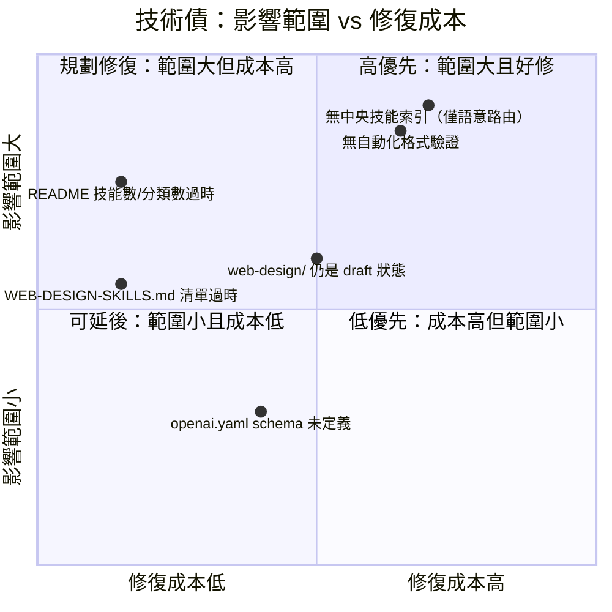

# Discovery Log — 探索紀錄與待解問題彙整

> 本文件彙整 `MengTo/Skills` codebase trace 過程中的探索發現、文件與實際落差、技術債與待確認事項。所有數字皆於 2026-07-13 以下列指令重新驗證：
> `find agent-skills -mindepth 2 -maxdepth 2 -type d | wc -l`、`find agent-skills -name SKILL.md | wc -l`、逐分類 `find agent-skills/<cat> -mindepth 1 -maxdepth 1 -type d | wc -l`。

---

## 1. Web Search 發現摘要

| 來源 | 關鍵 Takeaway |
|------|---------------|
| [GitHub - MengTo/Skills](https://github.com/MengTo/Skills) | 維護者為 Meng To（Design+Code 創辦人、Aura Build 製作者）。公開時聲稱「75 skills for Codex, Claude Code, Cursor」，聚焦 web design、landing page、motion、WebGL、UI、素材管理。 |
| [Meng To on X](https://x.com/MengTo/status/2074511787073106194) | 開源宣布貼文列出代表性技能（Video to Super Prompt、HTML to Interaction Prompts），對應 `README.md` 開頭的 flagship workflow。 |
| [Aura Build](https://www.aura.build) / [Design+Code](https://designcode.io) | 本 repo 與作者商業產品 Aura Build（AI 網頁生成工具）、Design+Code（教學平台）同屬一個生態系；部分技能（如 `html-to-interaction-prompts`）明確以 Aura Build 產出的 HTML 為輸入情境。 |

未深入搜尋項目：第三方函式庫官方文件（已由各技能 `REFERENCES.md` 涵蓋）、Discord/Slack 社群（未發現公開連結）、GitHub Issue/Discussion（repo 規模小，未見相關討論）。

---

## 2. 文件與實際內容落差清單（已用指令逐一驗證）

### 2.1 README.md「75 skills」宣稱 vs 實際數量

`README.md:149`："This snapshot contains **75 skills** across four categories."

實測結果：

```bash
$ find agent-skills -name "SKILL.md" | wc -l
95
$ find agent-skills -mindepth 2 -maxdepth 2 -type d | wc -l
95
```

**文件說 75，實際是 95，位於 `agent-skills/`（`README.md:149` 描述失準）。**

分類層級的落差更明顯（`README.md` 逐分類小標題 vs 實測資料夾數）：

| 分類 | README 標示數 | 實際數量 | 差異 | 來源 |
|------|--------------|---------|------|------|
| Codex workflows | 10（`README.md:153`） | 18 | +8 | `agent-skills/codex/` |
| Media | 2（`README.md:167`） | 2 | 0（一致） | `agent-skills/media/` |
| UI | 1（`README.md:176`，只列 `design-first-ui-prompting`） | 13 | +12 | `agent-skills/ui/` |
| Web design | 62（`README.md:194`） | 62 | 0（一致，唯一完全同步的分類） | `agent-skills/web-design/` |
| **合計** | **75** | **95** | **+20** | — |

**解讀**：`README.md` 的「Current library」章節本身就承認自己是「snapshot」（快照），且明文建議 `find agent-skills -name SKILL.md | sort` 作為 source of truth（`README.md:151`）——顯示作者已預期此文件會過時，只是尚未更新。Web design 分類數字剛好吻合，暗示這是最近一次更新時唯一同步的分類；Codex 與 UI 分類則明顯是後續新增技能後未回頭更新 README。

### 2.2 `agent-skills/web-design/WEB-DESIGN-SKILLS.md` 清單 vs 實際目錄

`agent-skills/web-design/WEB-DESIGN-SKILLS.md` 開頭寫著「Agent Web Design Skills (**draft set**)」，「Included skills」清單僅列出 **12** 個技能（`gsap`、`threejs`、`tailwindcss`、`css-border-gradient`、`css-alpha-masking`、`progressive-blur`、`animation-on-scroll`、`matterjs`、`globe-gl`、`vantajs`、`cobejs`、`unicorn-studio`）。

實測：

```bash
$ find agent-skills/web-design -mindepth 1 -maxdepth 1 -type d | wc -l
62
```

**文件說 12，實際是 62，位於 `agent-skills/web-design/`（落差 50 個技能未被此索引收錄）。**

該檔案定位是「draft set」的早期清單，隨技能快速新增已嚴重過時，且 `agent-skills/web-design/README.md` 本身也承認「Pending: finalize each skill's SKILL.md based on docs research, then package for use」，說明 `web-design/` 整個子集仍被作者視為草稿狀態（詳見 §7 待確認問題）。

### 2.3 recon.md 內部統計與本次覆核的差異

`.trace/_context/recon.md:82` 估計技能資料夾數「約 99 個（codex 19 + media 3 + ui 14 + web-design 63）」。本次以 `find` 精確覆核後，實際為 **95 個（codex 18 + media 2 + ui 13 + web-design 62）**，每個分類都少 1。推測原因是 recon 階段計數包含了非技能用途的資料夾（例如分類根目錄下的 `README.md`/`WEB-DESIGN-SKILLS.md` 所在層級被誤算，或 `.git`/隱藏目錄干擾）。**本文件之後所有統計以 95 為準。**

---

## 3. TODO / FIXME / HACK 掃描結果

```bash
grep -rn "TODO\|FIXME\|HACK\|XXX" agent-skills/ --include="*.md" --include="*.py" \
  --include="*.sh" --include="*.mjs" --include="*.swift" --include="*.ps1" --include="*.yaml"
```

僅命中 2 筆，且皆非真正的待辦標記：

| 檔案 | 內容 | 說明 |
|------|------|------|
| `agent-skills/ui/full-output-enforcement/SKILL.md:16` | 列舉 LLM 常見的「懶惰截斷」寫法（`// TODO`、`// ...` 等）作為**反面範例**，供技能規則引用禁止 | 屬技能內容本身，非未完成標記 |
| `agent-skills/ui/stitch-design-taste/SKILL.md:132` | `**[Accent Name]** (#XXXXXX)` | Markdown 模板中的 placeholder 語法，供 agent 填入實際色碼，非 HACK 標記 |

**結論：repo 內無傳統意義的技術債標記（TODO/FIXME/HACK）。** 這與其「純內容庫、無長期執行程式碼」的定位一致——技術債改以「文件落差」「治理規則缺失」形式存在（詳見 §4、§5）。

---

## 4. 未解答的疑問 / 模糊地帶（彙整自 `_context/*.md` 的 ⚠️ 未驗證標記）

| # | 疑問 | 來源檔案 |
|---|------|---------|
| 1 | `SKILL.md` frontmatter 是否符合 `CLAUDE.md` 資料夾契約，目前無任何自動化工具驗證，完全依賴人工 review 與 agent 自身容錯解讀 | `.trace/_context/data_flow.md`（Validation 章節） |
| 2 | 何時該開新分類（`agent-skills/<new-category>/`）vs 塞進既有分類，目前無明文治理規則，屬慣例而非強制規範 | `.trace/_context/extensions.md` |
| 3 | `agents/openai.yaml`（Codex 專屬技能綁定設定）的實際 schema 規格未見官方說明文件，多數檔案為空或極簡內容，用途未完全確認 | `.trace/_context/extensions.md` |
| 4 | `agent-skills/codex/elevenlabs-tts/scripts/generate_voice.py` 內部錯誤處理細節未在 `SKILL.md` 中說明，需讀腳本原始碼才能確認失敗行為 | `.trace/_context/integrations.md` |
| 5 | `agent-skills/codex/x-bookmark-quote-posts/` 是否透過 X API 呼叫或純瀏覽器操作，尚未讀取原始碼確認 | `.trace/_context/integrations.md` |
| 6 | 公開發布聲明的技能數（75）與目前 repo 實際數量（95，見 §2.1）不一致，推測是持續新增所致，但未經作者證實 | `.trace/_context/web_findings.md` |
| 7 | `agent-skills/web-design/WEB-DESIGN-SKILLS.md` 清單內容與實際目錄嚴重落後（12 vs 62，見 §2.2），該檔案的維護狀態/是否仍打算更新未知 | `.trace/_context/recon.md` |

---

## 5. 已知技術債



| 技術債 | 說明 | 影響 |
|--------|------|------|
| **無自動化驗證技能格式** | 沒有 CI/lint 腳本檢查 `SKILL.md` 是否具備必要 frontmatter（`name`/`description`）、資料夾是否符合契約。目前全靠人工 review。 | 新增技能品質參差，可能出現 frontmatter 缺漏而完全無法被語意路由發現（silent failure，無報錯機制）。 |
| **無中央技能索引，僅語意比對** | 沒有可程式化查詢的 index/manifest 檔案列出全部 95 個技能。Agent 完全依賴掃描 `description` frontmatter 做語意比對（詳見 `entry_points.md`）。 | 隨技能數持續增長（75→95，短期內 +27%），語意路由的準確度與可能的技能間描述重疊/衝突風險會上升，且新使用者難以「瀏覽全貌」。 |
| **README 技能數/分類統計過時** | `README.md:149` 的「75 skills」與逐分類數字已與實際脫節（見 §2.1），且 codex/ui 分類明細列表也不完整（只列出部分技能名稱）。 | 降低文件可信度；新貢獻者或下游使用者可能誤判技能庫規模與涵蓋範圍。 |
| **`WEB-DESIGN-SKILLS.md` 為過時的 draft 清單** | 僅列 12/62 個技能，且檔案自稱是「draft set」（見 §2.2）。 | 若被當作該分類的權威索引使用，會嚴重低估可用技能數。 |
| **`agents/openai.yaml` 缺乏規格文件** | Codex 專屬技能可附加此設定檔，但 repo 內無說明其 schema、必要欄位、如何生效（見 §4 #3）。 | 貢獻者不確定該檔案該怎麼寫，可能導致空檔案氾濫（目前多數確實是空的/極簡的）。 |
| **`web-design/` 子集整體仍標記為 draft** | `agent-skills/web-design/README.md` 明文寫「Pending: finalize each skill's SKILL.md based on docs research, then package for use」，但此分類已是規模最大（62/95，約 65%）的分類。 | 「draft」標籤與「repo 中最大宗內容」的現實不一致，需要作者澄清定位（詳見 §7）。 |

---

## 6. 需要更深入調查的區域

1. **`agent-skills/codex/*/scripts/` 內各腳本的實際錯誤處理與跨平台相容性**（尤其 `screenshot/` 的 5 個平台變體腳本、`elevenlabs-tts/generate_voice.py`）——目前僅從 `SKILL.md` 文字描述推論行為，未逐行讀取腳本原始碼驗證。
2. **`agents/openai.yaml` 是否真的被 Codex runtime 消費、或只是預留欄位** ——需要外部（Codex 官方文件或作者）確認，repo 內無法自證。
3. **`web-design/` 62 個技能之間是否存在風格/技術重疊或衝突**（例如多個 GSAP 相關技能：`gsap`、`gsap-scrolltrigger-storytelling`、`cinematic-gsap-lenis-motion-system` 之間的邊界）——語意路由在此類高密度重疊區域的實際準確度未經測試。
4. **`x-bookmark-quote-posts` 技能的 X/Twitter 整合方式**（API vs 瀏覽器操作），影響它是否該被歸類進「外部服務整合」清單的認證/失敗處理章節。

---

## 7. 需要與維護者（Meng To）確認的問題清單

1. **技能棄用/歸檔策略**：目前無任何技能被標記為 deprecated 或移除的先例。若某技能的實作方式過時（例如某動效庫升級），是直接編輯覆蓋、加版本號、還是移到新資料夾並保留舊的？
2. **`web-design/` 是否仍是 draft 狀態？** 該分類的 `README.md` 與 `WEB-DESIGN-SKILLS.md` 都停留在早期草稿措辭，但目前已佔 repo 技能總數的 65%（62/95）。是否該移除「draft」標籤，或者這個標籤仍然刻意保留、代表尚未經過完整品質把關？
3. **README.md 的技能數/分類統計是否要改成自動生成**？目前是手動維護的靜態數字（75 skills），已與實際（95）脫節超過 25%。是否考慮加入一個簡單的 CI 腳本（例如 `find agent-skills -name SKILL.md | wc -l`）在合併時自動更新該數字，避免文件持續漂移？
4. **是否需要中央技能索引（manifest）**？目前完全依賴 agent 語意比對 `description` frontmatter 做路由。隨技能數持續成長，是否考慮加入一份結構化索引（如 JSON/YAML）供程式化查詢，或這與「輕量內容庫」的設計哲學相悖，刻意不做？
5. **新分類的開設門檻**：`codex/` / `media/` / `ui/` / `web-design/` 四個分類是否為固定分類表，還是任何貢獻者可自由新增第五個分類（例如未來的 `backend/`）？是否有分類粒度的指導原則？
6. **`agents/openai.yaml` 的用途與規格**：多數該檔案是空的或極簡的，是否只是預留給未來 Codex 功能使用的佔位檔案，還是目前就有作用但作者尚未寫文件說明？

---

## 附：驗證方法紀錄

所有 §2 的數字皆可用以下指令重現（於 repo 根目錄執行）：

```bash
find agent-skills -name "SKILL.md" | wc -l                              # 95
find agent-skills -mindepth 2 -maxdepth 2 -type d | wc -l                # 95
for d in codex media ui web-design; do
  echo -n "$d: "; find agent-skills/$d -mindepth 1 -maxdepth 1 -type d | wc -l
done
# codex: 18 / media: 2 / ui: 13 / web-design: 62
grep -n "75 skills\|### Codex workflows\|### Media\|### UI\|### Web design" README.md
```
