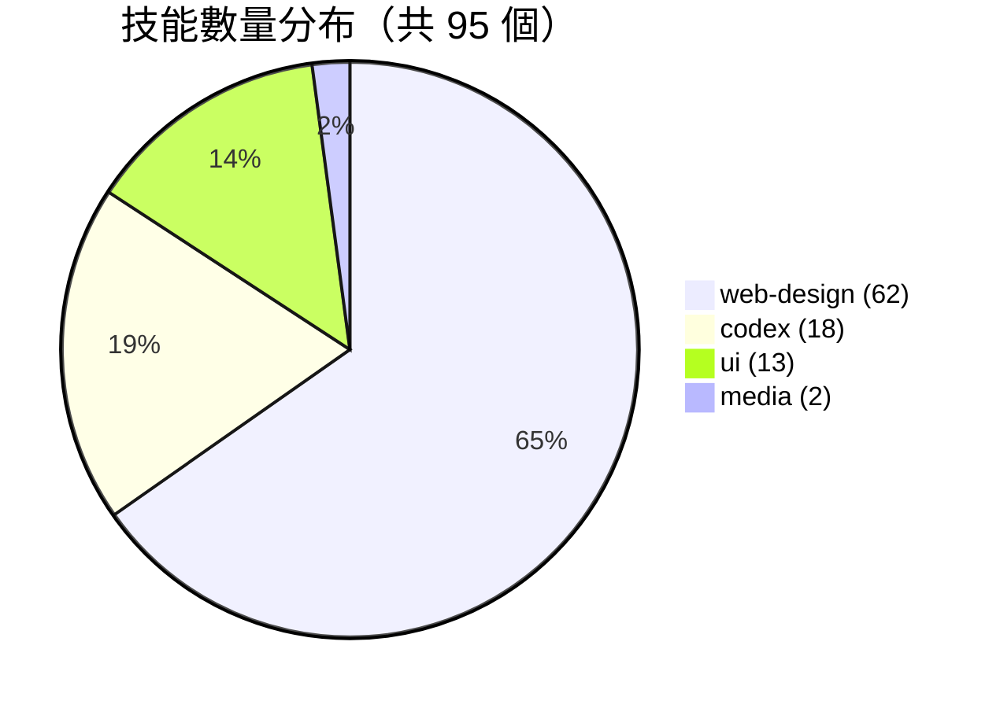
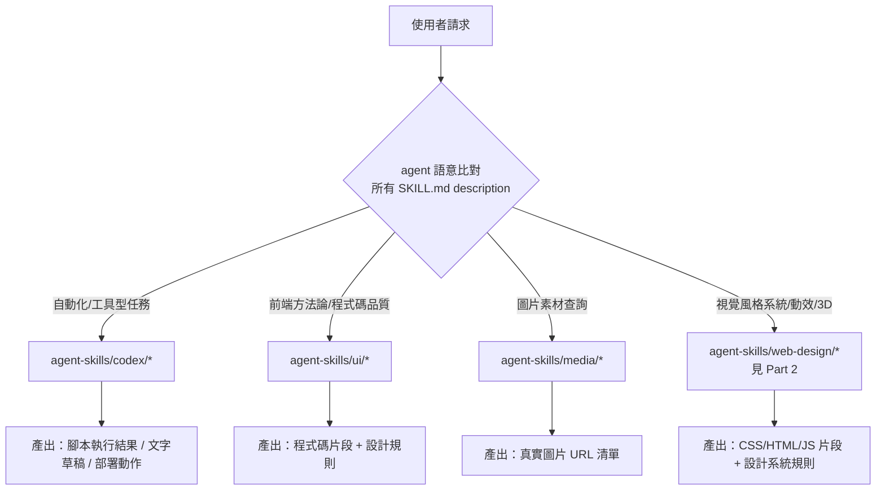

# SKILL_CATALOG（Part 1 / 2）— codex / media / ui

> 本文件置換原模板的 `API_SURFACE.md`。此 repo（MengTo/Skills）是純 AgentSkills 內容庫，沒有 REST/GraphQL/CLI
> 應用程式介面；「public surface」的等價概念是每個技能 `SKILL.md` frontmatter 的 `name` + `description` ——
> 這是技能對外（對 agent）暴露的「介面簽名」，決定 agent 何時會語意比對並載入它。
>
> 依規模拆分為兩份：
> - **Part 1（本檔）**：`codex/`（18）+ `media/`（2）+ `ui/`（13）＝ 33 個技能
> - **Part 2**：`web-design/`（62 個技能） → 見 [`SKILL_CATALOG_part2.md`](./SKILL_CATALOG_part2.md)
>
> 全庫共掃描到 **95 個技能資料夾**（每個都含必要的 `SKILL.md`）。
> ⚠️ 與 `.trace/_context/recon.md` 估計值（約 99）不同——recon 為粗估，本檔為逐一 `find agent-skills -name SKILL.md` 實測結果（codex 18、media 2、ui 13、web-design 62，總計 95）。

## 分類技能數量總覽

---

## 1. `agent-skills/codex/`（18 個技能）

Codex 專屬技能集中在「自動化工具型」任務：截圖、瀏覽器自動化、TTS、部署、效能剖析、客服信件處理等。多數技能不含 `scripts/`，屬純指令型；含 `scripts/` 的技能（elevenlabs-tts、playwright、screenshot、stitched-full-page-capture）才有可執行邏輯。

| 技能名稱 | 路徑 | 觸發時機（濃縮自 description） | scripts / REFERENCES / ARTICLE |
|---|---|---|---|
| audit-verify-explain-grade-5 | `agent-skills/codex/audit-verify-explain-grade-5/` | 審查、驗證、用淺白語言解釋變更結果、測試結果摘要 | 無 / 無 / 無 |
| copywriting | `agent-skills/codex/copywriting/` | 撰寫/改寫行銷文案（首頁、landing page、pricing、feature、about） | 無 / 無 / 無 |
| customer-email-draft-threads | `agent-skills/codex/customer-email-draft-threads/` | 僅產出草稿的 Gmail 客服信件分流，並為每封草稿建立 Codex project thread | 無 / 無 / 無 |
| customer-support-verification | `agent-skills/codex/customer-support-verification/` | 客服工作完成前的最終驗證閘門（runbook/草稿安全/證據/變更範圍） | 無 / 無 / 無 |
| daily-ui-inspiration-capture | `agent-skills/codex/daily-ui-inspiration-capture/` | 建立每日 UI 靈感擷取（`articles/YYYY-MM-DD-ui-inspiration-capture/`），含 Framer/Dribbble 擷取、去重驗證 | 有 `scripts/check-ui-inspiration-duplicates.mjs`（見下方驗證範例） / 無 / 無 |
| elevenlabs-tts | `agent-skills/codex/elevenlabs-tts/` | 用 ElevenLabs 產生 TTS 語音（旁白、配音） | **有 scripts** / 無 / 無 |
| html-to-interaction-prompts | `agent-skills/codex/html-to-interaction-prompts/` | 將提供的 HTML 頁面轉為含截圖佐證的互動提示詞文章 | 無 / 無 / 無 |
| netlify-deploy | `agent-skills/codex/netlify-deploy/` | 用 Netlify CLI（`npx netlify`）部署網站（preview/production） | 無 / 無 / 無 |
| optimize-web-animations | `agent-skills/codex/optimize-web-animations/` | 剖析/優化前端動畫效能，抓記憶體洩漏、CSS/canvas/WebGL rAF 迴圈問題 | 無 / 無 / 無 |
| pdf | `agent-skills/codex/pdf/` | 讀取/建立/審查 PDF，重視版面渲染正確性（Poppler + reportlab/pdfplumber/pypdf） | 無 / 無 / 無 |
| performance-profiling | `agent-skills/codex/performance-profiling/` | Apple 平台 App 效能剖析（Instruments、Xcode 診斷、MetricKit） | 無 / 無 / 無 |
| playwright-interactive | `agent-skills/codex/playwright-interactive/` | 透過 `js_repl` 做持久化瀏覽器/Electron 互動偵錯 | 無 / 無 / 無 |
| playwright | `agent-skills/codex/playwright/` | 從終端機自動化真實瀏覽器（導覽、填表、截圖、資料擷取） | **有 scripts**（`playwright_cli.sh`）/ 無 / 無 |
| screenshot | `agent-skills/codex/screenshot/` | 明確要求桌面/系統層級截圖（全螢幕、特定 App、像素區域） | **有 scripts**（含 `ensure_macos_permissions.sh`）/ 無 / 無 |
| stitched-full-page-capture | `agent-skills/codex/stitched-full-page-capture/` | 修復/擷取 lazy-load、scroll 動畫、Framer、WebGL 頁面的完整長截圖 | **有 scripts**（`.mjs`）/ 無 / 無 |
| swiftui-debugging | `agent-skills/codex/swiftui-debugging/` | 診斷 SwiftUI 渲染效能問題（不必要的 body 重算、卡頓、view identity bug） | 無 / 無 / 無 |
| video-to-superprompt | `agent-skills/codex/video-to-superprompt/` | 將參考影片轉為超詳細重製/靈感提示詞 | 無 / 無 / 無 |
| x-bookmark-quote-posts | `agent-skills/codex/x-bookmark-quote-posts/` | 檢視 X/Twitter 書籤，將近期收藏轉為有來源佐證的 quote-post 草稿 | 無 / 無 / 無 |

## 2. `agent-skills/media/`（2 個技能）

純唯讀圖片素材查詢技能，不呼叫需認證的 API，只回傳公開網頁的圖片 URL。

| 技能名稱 | 路徑 | 觸發時機（濃縮自 description） | scripts / REFERENCES / ARTICLE |
|---|---|---|---|
| aura-asset-images | `agent-skills/media/aura-asset-images/` | 需要 Aura Assets（aura.build/assets）高品質素材圖（背景、抽象、建築、人像），依 tag 搜尋並回傳 5 個真實 URL | 無 / 無 / 無 |
| unsplash-asset-images | `agent-skills/media/unsplash-asset-images/` | 需要 Unsplash 高品質圖片（頭像、人像、大型網站背景、抽象壁紙），回傳真實 URL 及尺寸比例建議（1:1, 4:5, 3:4, 16:9, 9:16） | 無 / 無 / 無 |

## 3. `agent-skills/ui/`（13 個技能）

UI/前端設計方法論類，多數是「覆寫 LLM 預設偏見」型技能（強制規則、風格準則），無外部服務整合。

| 技能名稱 | 路徑 | 觸發時機（濃縮自 description） | scripts / REFERENCES / ARTICLE |
|---|---|---|---|
| design-first-ui-prompting | `agent-skills/ui/design-first-ui-prompting/` | 需要 design-first、spec-driven、易讀的 UI 生成提示詞 | 無 / **有** / **有** |
| design-taste-frontend | `agent-skills/ui/design-taste-frontend/` | Senior UI/UX Engineer 人格，覆寫 LLM 預設偏見，強制 metric-based 規則、嚴格元件架構 | 無 / 無 / 無 |
| frontend-design | `agent-skills/ui/frontend-design/` | 建立高品質、有辨識度的前端介面（元件、頁面、artifact、React、HTML/CSS） | 無 / 無 / 無 |
| full-output-enforcement | `agent-skills/ui/full-output-enforcement/` | 覆寫 LLM 預設截斷行為，強制完整程式碼輸出、禁用 placeholder 模式 | 無 / 無 / 無 |
| gpt-taste | `agent-skills/ui/gpt-taste/` | Elite UX/UI & GSAP Motion Engineer 人格，強制隨機化版面變化、AIDA 結構、gapless bento grid | 無 / 無 / 無 |
| high-end-visual-design | `agent-skills/ui/high-end-visual-design/` | 教 AI 用高端 agency 標準設計（精確字體、間距、陰影、卡片結構、動畫） | 無 / 無 / 無 |
| image-to-code | `agent-skills/ui/image-to-code/` | 進階 image-to-code：先自行生成設計圖、深度分析，再實作匹配網站 | 無 / 無 / 無 |
| industrial-brutalist-ui | `agent-skills/ui/industrial-brutalist-ui/` | 工業/軍規美學介面（瑞士排版 + 終端機視覺），適合資料密集儀表板 | 無 / 無 / 無 |
| minimalist-ui | `agent-skills/ui/minimalist-ui/` | 乾淨編輯式介面，暖色調單色系、扁平 bento grid，無漸層無重陰影 | 無 / 無 / 無 |
| redesign-existing-projects | `agent-skills/ui/redesign-existing-projects/` | 將既有網站/App 升級到高端品質，審查通用 AI 模式並套用高端標準 | 無 / 無 / 無 |
| seo-audit | `agent-skills/ui/seo-audit/` | 稽核/診斷網站 SEO 問題（技術 SEO、meta tags、page speed、Core Web Vitals） | 無 / 無 / 無 |
| stitch-design-taste | `agent-skills/ui/stitch-design-taste/` | 為 Google Stitch 產生 agent 友善的 `DESIGN.md`，強制高端反通用 UI 標準 | 無 / 無 / 無 |
| swiftui-pro | `agent-skills/ui/swiftui-pro/` | 全面審查 SwiftUI 程式碼的最佳實踐、可維護性、效能 | 無 / 無 / 無 |

---

## 代表性範例：輸入意圖 → 觸發技能 → 產出形式

挑選 5 個 Part 1 中具代表性的技能，展示語意比對如何運作：

| # | 使用者輸入意圖 | 觸發技能 | 產出形式 |
|---|---|---|---|
| 1 | 「幫我把這個 landing page 的文案改得更有說服力」 | `codex/copywriting`（description 明文列出 "improve this copy"、"rewrite this page" 等觸發句） | Markdown 文案草稿（headline、CTA、value proposition 等區塊） |
| 2 | 「幫我把這個網站部署到 Netlify」 | `codex/netlify-deploy` | 執行 `npx netlify` CLI 指令序列，回報 preview/production 部署結果 |
| 3 | 「這段 SwiftUI list 滾動很卡，幫我看看」 | `codex/swiftui-debugging` | 診斷報告：指出過度 body 重算、view identity 問題、`@Observable` 範圍疑慮，附修正建議 |
| 4 | 「我要一組人像頭像的免費圖片，正方形」 | `media/unsplash-asset-images` | 5 個真實 Unsplash 圖片 URL + 1:1 尺寸產出建議 |
| 5 | 「幫我寫一個 React 儀表板頁面，風格要有質感、不要像 AI 生成的」 | `ui/frontend-design` | 完整 React/HTML/CSS 元件程式碼，套用「避免通用 AI 美學」的設計規則 |

⚠️ 上述「產出形式」為依據 `SKILL.md` description 與內文合理推論的預期行為，非實際執行紀錄——本 trace 未實際呼叫任何 agent 執行這些技能。

---

## Authentication & Authorization 模型（置換版）

本 repo 沒有應用程式層級的認證機制。認證需求分散在**個別技能**是否呼叫外部服務：

| 需要外部憑證/環境變數的技能 | 憑證來源 | 依據 |
|---|---|---|
| `codex/elevenlabs-tts` | 環境變數 `ELEVENLABS_API_KEY` 或最近的 `.env`（明確禁止把金鑰、voice id、帳號資訊寫進技能本身） | `.trace/_context/integrations.md`；`SKILL.md:5-8` 治理原則引述見下 |
| `codex/netlify-deploy` | 依賴使用者已登入的 Netlify CLI session（`npx netlify status` 檢查），非環境變數 | `.trace/_context/integrations.md` |
| `codex/screenshot` | macOS/Windows 系統層級權限（非 API 金鑰），由 `scripts/ensure_macos_permissions.sh` 確保 | `.trace/_context/integrations.md`、`.trace/_context/entry_points.md:43` |
| `codex/x-bookmark-quote-posts` | ⚠️ 未驗證——需讀原始碼確認是 API 呼叫還是純瀏覽器操作 | `.trace/_context/integrations.md:15` |

**完全開放、無需認證的技能**：`codex/` 中其餘 14 個技能（audit-verify-explain-grade-5、copywriting、customer-email-draft-threads*、customer-support-verification、daily-ui-inspiration-capture、html-to-interaction-prompts、optimize-web-animations、pdf、performance-profiling、playwright、playwright-interactive、stitched-full-page-capture、swiftui-debugging、video-to-superprompt）、`media/` 全部 2 個、`ui/` 全部 13 個——皆為純方法論/本機工具型技能，不需要外部帳號或 API 金鑰。

\* `customer-email-draft-threads` 隱含依賴使用者已透過 Gmail MCP/整合完成認證，但該認證屬於下游 agent 環境設定，非技能本身持有的憑證。

**治理原則**（引自 `agent-skills/codex/elevenlabs-tts/SKILL.md`，與 `CLAUDE.md` 的 Safety 守則一致）：
> Do not store API keys, voice names, voice ids, emails, account names, customer names, or personal defaults in the skill. Read `ELEVENLABS_API_KEY` from the process environment or the nearest `.env`.

即所有需要憑證的整合都採「外部化設定」模式，技能檔案本身保持可攜、可公開分享。

---

## Error Handling Pattern（置換版）— 內建強制規則如何預防錯誤

本 repo 沒有程式碼層級的 try/catch 或例外處理架構；取而代之，部分技能在 `SKILL.md` 內用 **[MANDATORY]/[CRITICAL] 強制規則**與**顯式驗證步驟**扮演「錯誤預防」角色：

| 技能 | 強制規則/驗證機制 | 作用 |
|---|---|---|
| `ui/full-output-enforcement` | 「Before finalizing any response, verify: ...」（`SKILL.md:45`） | 在輸出前插入驗證檢查點，防止截斷/佔位符輸出 |
| `ui/gpt-taste` | `## 8. MANDATORY PRE-FLIGHT <design_plan>`（`SKILL.md:67`）；「Only output the UI code after this rigorous verification is complete.」（`SKILL.md:74`） | 強制先產出設計計畫並驗證 grid `col-span`/`row-span` 是否數學上密合，才能輸出程式碼 |
| `ui/frontend-design` | 「**CRITICAL**: Choose a clear conceptual direction and execute it with precision.」（`SKILL.md:19`） | 防止設計方向搖擺不定、風格拼接不一致 |
| `codex/customer-support-verification` | 完整 13 項 PASS/FAIL/UNKNOWN 檢查清單（runbook 是否讀取、草稿是否誤發送、是否有未經核准的 mutation 等） | 作為客服工作流程的**最終驗證閘門**，是本 repo 中最完整的顯式錯誤預防機制 |
| `codex/daily-ui-inspiration-capture` | 要求 commit 前執行 `node scripts/check-ui-inspiration-duplicates.mjs`（`SKILL.md` Verification 章節） | 用可執行腳本做去重驗證，是少數有「可執行驗證步驟」而非純文字規則的技能 |

**模式歸納**：這些規則的共同角色相當於傳統軟體的「輸入驗證」與「前置條件檢查」——差別在於執行者是 LLM 本身依指示自我檢查，而非執行期程式碼強制擋下。因此「失敗」通常不是拋出例外，而是 agent 產出不合格結果卻未被攔截。強制規則的存在正是為了把這種「靜默劣化」的風險降到最低。

---

## Rate Limiting / Pagination

⚠️ **不適用**。本 repo 無任何技能對外提供可被呼叫的 API endpoint，因此沒有「呼叫頻率限制」或「分頁」的概念。

僅有的外部服務呼叫（見上方 Authentication 表）均由**使用者端**的既有服務條款/限額約束（例如 ElevenLabs 帳號的用量額度、Netlify 部署頻率），而非技能本身定義或强制任何 rate limit。`.trace/_context/integrations.md` 未提及任何技能明確引用外部服務的 rate limit 數字，故此處不編造具體數值。

---

（Part 1 完，共 33 個技能。web-design 分類 62 個技能請見 [`SKILL_CATALOG_part2.md`](./SKILL_CATALOG_part2.md)）
