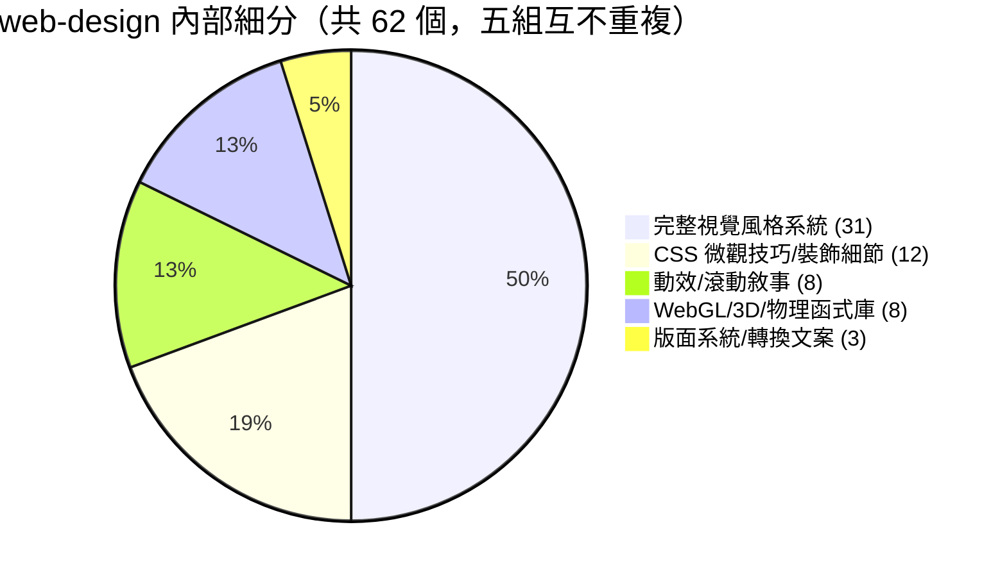
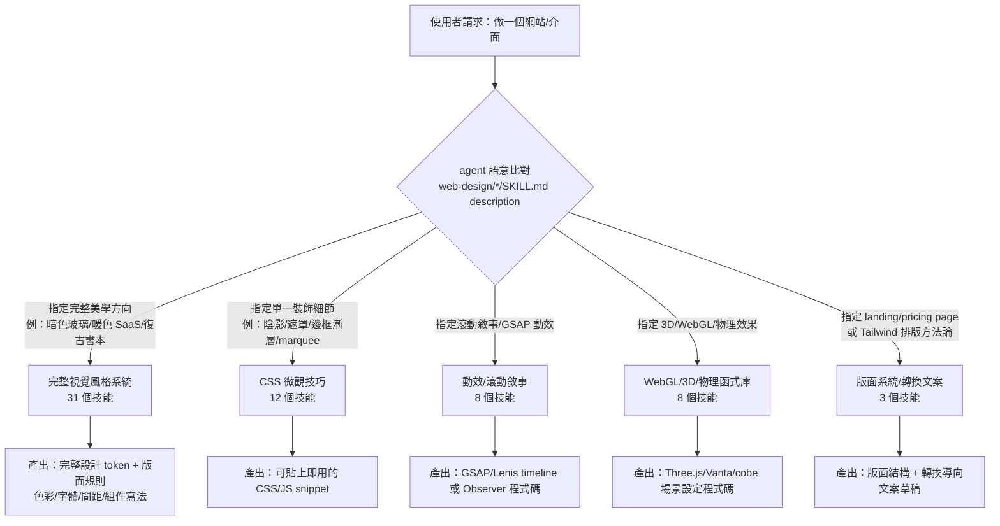

# SKILL_CATALOG（Part 2 / 2）— web-design

> 承接 [`SKILL_CATALOG_part1.md`](./SKILL_CATALOG_part1.md)（codex 18 + media 2 + ui 13 ＝ 33 個技能）。
> 本檔為 **Part 2**，逐一列舉 `agent-skills/web-design/` 分類下**全部 62 個技能**——同樣以每個技能
> `SKILL.md` frontmatter 的 `name` + `description` 作為「對外介面簽名」，決定 agent 何時會語意比對並載入它。
>
> 這個分類是全庫最大宗（62／95 個技能，約 65%），內容集中在**完整視覺風格系統**（一鍵套用整套設計語言）、
> **CSS 微觀技巧**（陰影、遮罩、邊框漸層等裝飾細節）、**動效/滾動敘事**（GSAP、Lenis、IntersectionObserver）、
> **WebGL/3D/物理函式庫**（Three.js、Vanta.js、globe.gl、Matter.js、cobe.js、Unicorn Studio），以及少數
> **版面系統/轉換導向文案**技能。以下依此五組分節，五組總數 31 + 12 + 8 + 8 + 3 = **62**，互不重複。

## 分類技能數量總覽（Part 2 內部細分）

---

## 1. 完整視覺風格系統類（31 個技能）

本組是分類中最大宗，且高度同構：`SKILL.md` 幾乎都是「一句 description + `## Use When` 重述同一句話」的極簡結構，通常只有一個 `SKILL.md`（無 `REFERENCES.md`/`scripts/`）。這些技能定義的是**一整套設計語言**（配色、材質、版面骨架、氛圍），而非單一元件——使用者描述想要的整體氛圍（例如「暗色玻璃儀表板」「復古書本風」「亮綠科技系統」），agent 語意比對到最貼近的系統後，一次產出完整 token 與版面規則。

| 技能名稱 | 路徑 | 觸發時機（濃縮自 description） | REFERENCES/scripts |
|---|---|---|---|
| agency-grid-layout-minimal | `agent-skills/web-design/agency-grid-layout-minimal/` | 極簡 agency 設計系統：嚴謹編輯式網格、超大字體、低調大寫標籤、克制圖片區塊 | 無 |
| atmosphere-background | `agent-skills/web-design/atmosphere-background/` | 暗色氛圍背景：垂直光褶漂移、screen-blend 光暈、角落或下緣聚光 | 無 |
| background-grid-webgl | `agent-skills/web-design/background-grid-webgl/` | 透視 WebGL 背景網格：淡出線條、微粒子霧、緩慢前進漂移、鏡頭視差 | 無 |
| blue-cloudy-clean-modern | `agent-skills/web-design/blue-cloudy-clean-modern/` | 藍天雲霧清新現代系統：柔光雲層、極簡白框、高階字體 | 無 |
| blue-laser-clean-glass-layout | `agent-skills/web-design/blue-laser-clean-glass-layout/` | 暗色玻璃系統：細藍雷射氛圍、霧面殼層、精緻儀表板結構 | 無 |
| book-serif-index | `agent-skills/web-design/book-serif-index/` | 檔案書本閱讀系統：襯線內文、mono 索引導覽、做舊紙面、邊註、目錄框架 | 無 |
| bright-green-tech-system-webgl | `agent-skills/web-design/bright-green-tech-system-webgl/` | 亮綠科技系統：結構化分割版面、硬邊暗面板、mono 標籤、WebGL 視覺化區 | 無 |
| clean-minimal-beige-light-mode | `agent-skills/web-design/clean-minimal-beige-light-mode/` | 米色極簡淺色系統：暖中性殼層、低對比流程網格、克制強調色 | 無 |
| corner-lasers | `agent-skills/web-design/corner-lasers/` | 角落錨定雷射構圖：細光束、發光節點、bloom、氛圍霧感 | 無 |
| dark-blue-contrasting-clean | `agent-skills/web-design/dark-blue-contrasting-clean/` | 暗藍高對比清新系統：鈷藍漸層特色區塊、俐落框線結構、克制高階光暈 | 無 |
| dark-glass-clean-layout | `agent-skills/web-design/dark-glass-clean-layout/` | 暗色玻璃版面系統：霧面殼層、多欄工作區、浮動資料卡、克制氛圍深度 | 無 |
| dither-background | `agent-skills/web-design/dither-background/` | 暗色單色程序背景：放大方形像素、可見 Bayer-style 有序抖動、有機波浪 | 無 |
| dither-laser-dark-mode | `agent-skills/web-design/dither-laser-dark-mode/` | 暗色系統：近黑底 + 細緻 dither 紋理 + 強調色細雷射氛圍 | 無 |
| editorial-tech | `agent-skills/web-design/editorial-tech/` | 雜誌編輯排版 × 精密科技細節：不對稱網格、電影感媒體帶、mono 標籤 | 無 |
| framed-grid-layout | `agent-skills/web-design/framed-grid-layout/` | 極簡框架網格版面：細可見邊界線、L 形角括號、對角紋理、嚴格區塊對齊 | 無 |
| framed-tech-dark-border-gradient | `agent-skills/web-design/framed-tech-dark-border-gradient/` | 暗色技術框架系統：border-gradient 殼層、不對稱網格面板、mono 標籤 | 無 |
| funky-purple-container-tech | `agent-skills/web-design/funky-purple-container-tech/` | 暗色容器導向科技系統：桃紫強調色、疊層圓角殼、趣味未來感焦點物件 | 無 |
| glass-dark-mode-clock | `agent-skills/web-design/glass-dark-mode-clock/` | 暗色玻璃系統：霧面殼、柔光束網格、圓形時鐘刻度、精準 sci-fi 儀器框架 | 無 |
| gooey-blob-system | `agent-skills/web-design/gooey-blob-system/` | SVG filter 驅動的 gooey blob 系統：多形狀依鄰近度融合為單一流體形態 | 無 |
| high-contrast-skeuomorphic-clean | `agent-skills/web-design/high-contrast-skeuomorphic-clean/` | 高對比清新擬物系統：塑形暗面、清晰光線分割、觸感內凹深度、克制訊號色 | 無 |
| image-first-grid-layout | `agent-skills/web-design/image-first-grid-layout/` | 圖像主導網格系統：滿版攝影、結構引導線、錨定內容區塊、克制技術疊層 | 無 |
| light-mode-paper-technical | `agent-skills/web-design/light-mode-paper-technical/` | 淺色技術系統：暖紙質面、深色外框、細對角紋理、精準括號幾何 | 無 |
| mesh-gradient-dark-blue-clean | `agent-skills/web-design/mesh-gradient-dark-blue-clean/` | 未來感暗藍 mesh-gradient 系統：近黑海軍藍底、程序化藍霧網格、行星深度感 | 無 |
| nested-container-clean-agency | `agent-skills/web-design/nested-container-clean-agency/` | 巢狀容器 agency 系統：外層編輯殼、內嵌暗色特色區塊、圓角高階卡片 | 無 |
| nested-container-frames | `agent-skills/web-design/nested-container-frames/` | 容器中容器巢狀框架系統：外層可見邊界+角標記，內層獨立背景圓角框 | 無 |
| orange-clean-paper-saas | `agent-skills/web-design/orange-clean-paper-saas/` | 紙質清新 SaaS 系統：暖中性色、橘色強調訊號、圓角高階形態、產品插圖面 | 無 |
| split-layout-technical | `agent-skills/web-design/split-layout-technical/` | 技術分割螢幕系統：雙面板、細框線、mono metadata、克制編輯式字體 | 無 |
| tech-green-dark-mode-modern | `agent-skills/web-design/tech-green-dark-mode-modern/` | 現代暗色科技系統：霧黑面、翠綠訊號強調、mono 系統標籤、框架儀表卡 | 無 |
| technical-wireframe-info-layout | `agent-skills/web-design/technical-wireframe-info-layout/` | 單色技術線框系統：爆炸式 3D 結構、連接註記、稀疏資訊標籤、診斷框架 | 無 |
| webgl-3d-object | `agent-skills/web-design/webgl-3d-object/` | 真實 3D WebGL 物件：幾何網格深度、PBR 材質、方向光+環境光、緩慢旋轉/漂浮 | 無 |
| webgl-laser | `agent-skills/web-design/webgl-laser/` | 固定全螢幕 WebGL 雷射背景：白熱垂直核心光束、克制品牌色暈、煙霧氛圍（僅限雷射背景，不動版面） | 無 |

## 2. CSS 微觀技巧 / 裝飾細節類（12 個技能）

不同於完整風格系統，這批技能是**單一、可獨立複用的 CSS/JS 片段**——陰影、遮罩、邊框漸層、無限捲動、圖示套用等。`SKILL.md` 多半附帶明確 `## Workflow`（先確認參數如方向/尺寸/環境，再給 snippet），比風格系統類更「工程化」，適合疊加在任何既有版面上。

| 技能名稱 | 路徑 | 觸發時機（濃縮自 description） | REFERENCES/scripts |
|---|---|---|---|
| beautiful-shadows | `agent-skills/web-design/beautiful-shadows/` | 套用精確 Tailwind arbitrary 陰影 utility，取代預設 Tailwind 陰影刻度或色調陰影 | 無 |
| company-logos | `agent-skills/web-design/company-logos/` | 用 Iconify Simple Icons（64x64）取代文字 logo | 無 |
| container-lines | `agent-skills/web-design/container-lines/` | 加入垂直容器尺寸引導線 + 小型角落方塊，用於精確結構化版面 | 無 |
| corner-diagonals | `agent-skills/web-design/corner-diagonals/` | 對按鈕/卡片/面板/容器殼套用對角切角、斜切邊緣，取代圓角或直角 | 無 |
| css-alpha-masking | `agent-skills/web-design/css-alpha-masking/` | 用 linear-gradient 做水平/垂直邊緣淡出的 CSS alpha mask（mask-image） | 無 |
| css-border-gradient | `agent-skills/web-design/css-border-gradient/` | 為卡片/定價面板/導覽列/彈窗/按鈕加上細緻漸層邊框，取代平面 border | 無 |
| glass-dark-ui | `agent-skills/web-design/glass-dark-ui/` | 用 pseudo-element mask 打造可讀對比、霧面表面的暗色玻璃擬態介面 | 無 |
| marquee-loop | `agent-skills/web-design/marquee-loop/` | 用重複項目套用無縫無限跑馬燈迴圈（logo、評價、截圖、標籤） | 無 |
| number-details | `agent-skills/web-design/number-details/` | 加入裝飾性 01、02、03 數字標記（流程步驟、功能群組、卡片） | 無 |
| progressive-blur | `agent-skills/web-design/progressive-blur/` | 用多層 backdrop-filter mask 做上/下漸進式 CSS 模糊 | 無 |
| skeuomorphic-ui | `agent-skills/web-design/skeuomorphic-ui/` | 疊層漸層+內外陰影+反光邊框+微紋理+浮雕文字/圖示的擬物 UI 表面 | 無 |
| solar-duotone-bold | `agent-skills/web-design/solar-duotone-bold/` | 使用 Iconify Solar Duotone Bold 圖示風格，取代通用外框圖示 | 無 |

## 3. 動效 / 滾動敘事類（8 個技能）

聚焦「時間軸驅動」的動畫技巧：進場、滾動觸發、逐字顯示、GSAP/Lenis 整合。3 個技能含 `REFERENCES.md`（`cinematic-gsap-lenis-motion-system`、`cinematic-scroll-storytelling`、`gsap`），代表這批技能對外部函式庫官方文件的參考需求較高。

| 技能名稱 | 路徑 | 觸發時機（濃縮自 description） | REFERENCES/scripts |
|---|---|---|---|
| animation-on-scroll | `agent-skills/web-design/animation-on-scroll/` | 用 IntersectionObserver 建立 scroll-reveal / animate-on-scroll 觸發，搭配 Tailwind class | 無 |
| animation-systems | `agent-skills/web-design/animation-systems/` | 設計/實作 Stripe、Linear、Apple、Vercel 級產品動效：原則、easing/duration、編排、a11y（reduced motion） | 無 |
| cinematic-gsap-lenis-motion-system | `agent-skills/web-design/cinematic-gsap-lenis-motion-system/` | 用 GSAP + ScrollTrigger + Lenis 打造電影感高端網站動效系統，含磁吸 hover、自訂游標、滑鼠反應層次動態 | **有 REFERENCES.md** |
| cinematic-scroll-storytelling | `agent-skills/web-design/cinematic-scroll-storytelling/` | 用 Lenis 平滑捲動 + GSAP ScrollTrigger 打造電影感捲動式敘事頁面（sticky 卡片堆疊、視差、preloader） | **有 REFERENCES.md** |
| gsap-scrolltrigger-storytelling | `agent-skills/web-design/gsap-scrolltrigger-storytelling/` | 用 GSAP ScrollTrigger 打造電影感 sticky 產品敘事、漸進式 UI 顯現、滾動同步動畫 | 無 |
| gsap | `agent-skills/web-design/gsap/` | 用 GSAP（timeline、ScrollTrigger、stagger、transform）新增/除錯專業網頁動效（HTML/CSS/JS/React） | **有 REFERENCES.md** |
| masked-reveal | `agent-skills/web-design/masked-reveal/` | 用 GSAP ScrollTrigger 打造逐字遮罩顯現效果（標題、hero 文案、章節標題進場） | 無 |
| staggered-word-reveal | `agent-skills/web-design/staggered-word-reveal/` | 逐字淡入上升的編輯式文字顯現動畫，用 IntersectionObserver/in-view 偵測（Portfolio 標題、精簡行銷文案） | 無 |

## 4. WebGL / 3D / 物理函式庫類（8 個技能）

這批技能是「特定第三方函式庫的操作手冊」型技能：cobe.js、globe.gl、Matter.js、Three.js、Unicorn Studio、Vanta.js。6 個含 `REFERENCES.md`，且 `## Workflow` 明確要求先確認執行環境（plain HTML / React / Next.js）再給程式碼，是本分類中「工程準確度」要求最高的一群。

| 技能名稱 | 路徑 | 觸發時機（濃縮自 description） | REFERENCES/scripts |
|---|---|---|---|
| cobejs | `agent-skills/web-design/cobejs/` | 用 cobe 加入輕量互動地球儀（canvas 設定、標記、互動、效能、React/Next.js 整合） | **有 REFERENCES.md** |
| globe-gl | `agent-skills/web-design/globe-gl/` | 用 globe.gl（WebGL/ThreeJS）做 3D 地球資料視覺化：points/arcs/polygons/labels，plain HTML 或 React 整合 | 無 |
| globe-particles | `agent-skills/web-design/globe-particles/` | 用真實 WebGL/Three.js 粒子打造星球狀 3D 粒子視覺化（緊密發光球核 + 扁平軌道環），非通用星空背景 | 無 |
| matterjs | `agent-skills/web-design/matterjs/` | 用 Matter.js 實作 2D 物理互動：Engine/World 設定、Render/Runner、剛體與約束、滾動友善 canvas 場景 | 無 |
| threejs | `agent-skills/web-design/threejs/` | 用 Three.js 建立/除錯互動 3D 場景（scene/camera/renderer、光照材質、GLTF 載入、controls、效能） | **有 REFERENCES.md** |
| unicorn-studio | `agent-skills/web-design/unicorn-studio/` | 嵌入並客製 Unicorn Studio 互動動畫（embed、響應式尺寸、效能、與 UI 分層、fallback） | **有 REFERENCES.md** |
| vantajs | `agent-skills/web-design/vantajs/` | 用 Vanta.js 加入動態 WebGL 背景特效（設定、參數、resize、React/Next.js 整合） | **有 REFERENCES.md** |
| webgl-landing-steering | `agent-skills/web-design/webgl-landing-steering/` | 建立/精修 WebGL 密集的 landing page，在高端/技術感/趣味/電影感等方向間取捨，兼顧轉換率清晰度與效能 | **有 REFERENCES.md** |

## 5. 版面系統 / 轉換導向文案類（3 個技能）

不同於「氛圍風格」，這 3 個技能是**頁面類型方法論**——聚焦轉換率、結構、文案策略與框架級排版慣例，與 Part 1 的 `codex/copywriting`、`ui/frontend-design` 性質相近但專屬於 web-design 分類，皆含完整 `REFERENCES.md`。

| 技能名稱 | 路徑 | 觸發時機（濃縮自 description） | REFERENCES/scripts |
|---|---|---|---|
| landing-page | `agent-skills/web-design/landing-page/` | 設計/改寫高轉換 landing page（SaaS/App/服務）：結構、版面模式、轉換策略、文案、SEO/AEO、常見誤區 | **有 REFERENCES.md** |
| pricing-page | `agent-skills/web-design/pricing-page/` | 設計/改寫高轉換 SaaS 定價頁：方案設計、文案、SEO/AEO、FAQ、版面模式、實驗方法 | **有 REFERENCES.md** |
| tailwindcss | `agent-skills/web-design/tailwindcss/` | 用 Tailwind CSS 設計/實作 UI（版面、字體、響應式、主題化、元件模式），含快速食譜與慣例 | **有 REFERENCES.md** |

---

## 完整 62 個技能計數核對

五組加總：31（風格系統）+ 12（CSS 微觀技巧）+ 8（動效/滾動敘事）+ 8（WebGL/3D/物理）+ 3（版面系統/轉換文案）＝ **62**，與 `find agent-skills/web-design -mindepth 1 -maxdepth 1 -type d | wc -l` 實測結果一致，五組彼此互不重複。

含 `REFERENCES.md` 的技能共 **11** 個：`cinematic-gsap-lenis-motion-system`、`cinematic-scroll-storytelling`、`cobejs`、`gsap`、`landing-page`、`pricing-page`、`tailwindcss`、`threejs`、`unicorn-studio`、`vantajs`、`webgl-landing-steering`。其餘 **51** 個僅有 `SKILL.md`，無 `REFERENCES.md`／`ARTICLE.md`／`scripts/`。這 11 個集中在「第三方函式庫操作手冊」（動效/WebGL 組）與「轉換導向方法論」（版面系統組），與 Part 1 的模式一致——純風格系統/CSS 片段類技能傾向自成一體、不外連參考資料。

本分類（web-design）**沒有任何技能含 `scripts/`**——與 Part 1 的 `codex/`（4 個技能有 `scripts/`：elevenlabs-tts、playwright、screenshot、stitched-full-page-capture）形成對比：web-design 的產出全部是「程式碼/設計規則文字」，不涉及本機可執行邏輯。

---

## 代表性範例：輸入意圖 → 觸發技能 → 產出形式

| # | 使用者輸入意圖 | 觸發技能 | 產出形式 |
|---|---|---|---|
| 1 | 「幫我做一個暗色玻璃質感的儀表板首頁，要有霧面卡片跟浮動資料卡」 | `web-design/dark-glass-clean-layout`（description 明文列出 "frosted premium shells"、"floating data cards"） | 完整設計 token（色彩/材質/間距）+ HTML/CSS 版面骨架，套用玻璃擬態多欄工作區結構 |
| 2 | 「這個 hero 區塊太平了，幫我加個漸層邊框，不要太浮誇」 | `web-design/css-border-gradient`（description 明文提及 "hero surfaces need a refined edge highlight without a loud glow"） | 單段可貼上的 CSS snippet（border-image 或 pseudo-element 漸層邊框），無需改動其他版面 |
| 3 | 「幫我用 GSAP + Lenis 做一個像 Awwwards 得獎作品那種捲動敘事網站，要有 pin 住的區塊跟視差」 | `web-design/cinematic-scroll-storytelling`（description 明文列出 "Lenis smooth scrolling"、"pinned scenes"、"parallax"） | GSAP ScrollTrigger + Lenis 完整 timeline 程式碼，含 sticky 卡片堆疊、preloader，並附 `REFERENCES.md` 連結官方文件 |

⚠️ 上述「產出形式」為依據 `SKILL.md` description 與內文合理推論的預期行為，非實際執行紀錄——本 trace 未實際呼叫任何 agent 執行這些技能。

---

## 與 Part 1 呼應：一致性與落差觀察

- **命名風格落差**：web-design 62 個技能中，31 個風格系統類採「形容詞+形容詞+名詞」複合命名（如 `dark-blue-contrasting-clean`、`funky-purple-container-tech`），而非動詞開頭；這與 Part 1 `codex/`、`ui/` 分類多用動詞/名詞短語命名（如 `netlify-deploy`、`design-taste-frontend`）不同，反映此分類技能本質是「選一個現成美學方案」而非「執行一個動作」。
- **description 品質落差**：風格系統類技能的 description 幾乎都與內文 `## Use When` 完全重複同一句話，觸發語意仰賴描述中的具體形容詞組合（顏色、材質、版面關鍵字）；相對地，函式庫操作類（`gsap`、`threejs`、`vantajs` 等）與轉換導向類（`landing-page`、`pricing-page`）的 description 更具「when to use」的明確判準語句，且都搭配 `REFERENCES.md`。
- **無任何外部服務整合**：與 Part 1 的 `codex/elevenlabs-tts`、`codex/netlify-deploy` 不同，web-design 全部 62 個技能皆為純前端程式碼/設計規則產出，不呼叫任何需要認證的外部 API，因此 Part 1 的 Authentication 表無需在 Part 2 重複列出。

---

（Part 2 完，共 62 個技能。SKILL_CATALOG 全系列（[Part 1](./SKILL_CATALOG_part1.md) + Part 2）共 **95 個技能**。）
