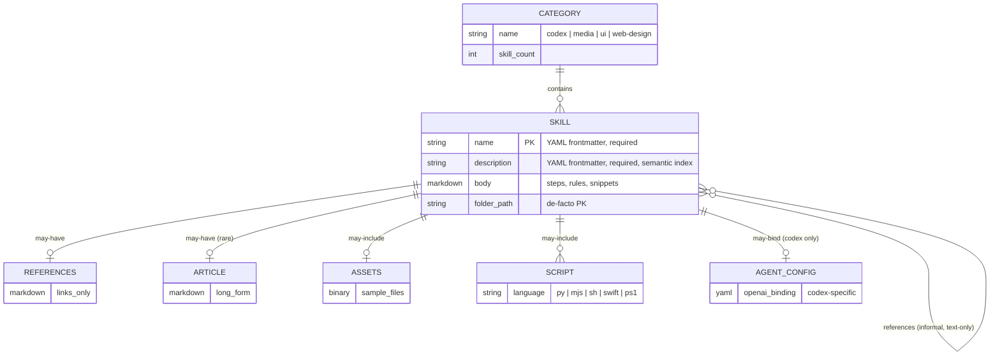
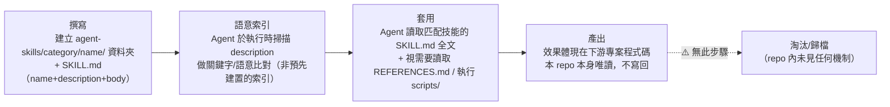

# SKILL_TAXONOMY.md — 技能分類體系文件

> 置換說明：本 repo（MengTo/Skills）是一個 AgentSkills 內容庫，沒有資料庫、沒有 ORM、沒有傳統的 data model。本文件取代原模板中的 `DATA_MODEL.md`，把「技能（Skill）」視為 repo 的核心 entity，把資料夾分類（`agent-skills/<category>/`）視為其 schema，比照 ER diagram 的方式描述其結構與關聯。所有統計數字皆於 2026-07-13 以 `find`/`grep` 直接掃描 `/home/user/mengto-Skills/agent-skills/` 取得（見文末指令記錄），非引用既有文件的估計值。

## 1. 核心 Entity：Skill

一個「技能」在磁碟上是一個資料夾（`agent-skills/<category>/<skill-name>/`），其「欄位」對應到資料夾內的檔案。下表比照 ORM model 欄位表格格式：

| 欄位（檔案/資料） | 型別 | 必要性 | 說明 |
|---|---|---|---|
| `name` | string（YAML frontmatter） | **必要** | 技能識別碼，通常與資料夾名一致（kebab-case）。95/95 個技能皆有此欄位。 |
| `description` | string（YAML frontmatter，單行，常見 60~700 字元） | **必要** | 語意比對用的觸發描述，供 agent 判斷「何時該用這個技能」。是唯一的「索引欄位」（見第 5 節）。 |
| 正文步驟（Markdown body） | 自由格式 Markdown | **必要** | `SKILL.md` 中 frontmatter 之後的內容：規則、預設值、checklist、code snippet。 |
| `REFERENCES.md` | Markdown（連結清單） | 可選 | 延伸閱讀連結，無大段說明文字（依 `CLAUDE.md` 慣例）。12 個技能含有。 |
| `ARTICLE.md` | Markdown（長文） | 可選 | 長篇補充材料。僅 1 個技能含有（⚠️ 未驗證是否為特例或該慣例已淘汰）。 |
| `assets/` | 目錄（圖片/範例檔） | 可選 | 5 個技能含有，集中在 `codex/`。 |
| `scripts/` | 目錄（可執行腳本：`.py`/`.mjs`/`.sh`/`.swift`/`.ps1`） | 可選 | 4 個技能含有，皆在 `agent-skills/codex/` 下（`elevenlabs-tts`、`screenshot`、`playwright`、`stitched-full-page-capture`）。 |
| `agents/openai.yaml` | YAML | 可選 | Codex 專屬的 agent 綁定設定，10 個技能含有，全數集中在 `agent-skills/codex/`。多數為空檔或極簡設定（依 `recon.md`，⚠️ 內容細節未逐檔驗證）。 |

**Primary key（等價概念）**：資料夾路徑 `agent-skills/<category>/<name>/` 本身即唯一鍵；`name` frontmatter 欄位理論上應與資料夾名一致，但 repo 內**無自動化機制**驗證兩者一致（見第 6 節）。

**Foreign key（等價概念）**：技能沒有顯式的外鍵欄位指向其他技能，但正文中偶有以自然語言互相引用（例如 `agent-skills/codex/copywriting/SKILL.md` 的「Related Skills」章節提及 `email-sequence`、`popup-cro`、`copy-editing`）。這是**弱關聯**，非結構化資料，agent 需自行解析文字才能追蹤。⚠️ 未驗證：是否所有互相引用的技能名稱都確實存在對應資料夾。

## 2. ER Diagram



## 3. 四大分類統計與內容傾向

| 分類 | 技能數 | SKILL.md 覆蓋率 | 內容傾向摘要 |
|---|---|---|---|
| `agent-skills/codex/` | 18 | 18/18（100%） | 流程/工具類技能：截圖、瀏覽器自動化（Playwright）、TTS、Netlify 部署、PDF 處理、SwiftUI/效能除錯、客服信件 triage 等。**唯一含可執行 `scripts/`（4 個）與 `agents/openai.yaml`（10 個）的分類**，較少涉及美學判斷，接近傳統自動化腳本 + 使用說明。 |
| `agent-skills/media/` | 2 | 2/2（100%） | 素材檢索類：`aura-asset-images`、`unsplash-asset-images`。核心是「如何用查詢詞找到對的圖」而非設計判斷。無任何可選檔案（REFERENCES/ARTICLE/assets/scripts 皆 0）。 |
| `agent-skills/ui/` | 13 | 13/13（100%） | 通用、跨技術棧的設計方法論：品味量化（`design-taste-frontend` 的 DESIGN_VARIANCE/MOTION_INTENSITY 等旋鈕）、架構慣例、反 LLM 風格漂移的規則（字體白名單、反 emoji）。含 1 個 REFERENCES.md、1 個 ARTICLE.md。 |
| `agent-skills/web-design/` | 62 | 62/62（100%） | **最大子集**，高度具體的單一視覺效果/風格系統實作食譜（如 `gsap`、`tailwindcss`、`globe-gl`，以及 `dark-glass-clean-layout`、`solar-duotone-bold` 等 60+ 個以美學方向命名的資料夾）。11 個含 REFERENCES.md（多指向 GSAP/Three.js 等官方文件），是四類中 REFERENCES.md 密度最高者。⚠️ 目錄下另有 `README.md` 與 `WEB-DESIGN-SKILLS.md` 兩份非技能檔案，用於說明此子集為「draft AgentSkills」，其清單內容與實際目錄數量有落差（見 `recon.md` 與 `DISCOVERY_LOG.md`，本文件未重新核對兩者差異細節）。 |
| **合計** | **95** | **95/95（100%）** | — |

（`recon.md` 原先估計「約 99 個技能資料夾」，與本次逐一 `find` 掃描得到的 95 有落差；本文件數字以本次直接掃描為準，⚠️ 未驗證此落差成因，可能是 recon 階段的粗略計數含了非技能資料夾。）

## 4. Frontmatter Schema 摘要

比照 ORM model 的角色，`SKILL.md` 開頭的 YAML frontmatter 是這個內容庫唯一的「結構化 schema」：

```yaml
---
name: skill-name-in-kebab-case
description: 一句到一段話，說明「何時該用這個技能」，常包含觸發關鍵字列表
---
```

| 欄位 | 角色類比 | 撰寫慣例 |
|---|---|---|
| `name` | 等價於 model 的 `id`/`slug` | 全數為 kebab-case，與資料夾名相同（95/95 一致，⚠️ 未做逐字元比對，僅目視抽樣確認）。少數技能將值以雙引號包住（如 `agent-skills/codex/pdf/SKILL.md` 的 `name: "pdf"`），屬風格差異非規則差異。 |
| `description` | 等價於 model 的可索引欄位（search vector） | 長度落差極大（實測 57～701 字元）。慣例是「條列多個觸發措辭 + 明確的 Use when 子句」，讓 agent 做關鍵字/語意雙重比對，例如 `agent-skills/codex/copywriting/SKILL.md` 的 description 直接列舉十餘種使用者措辭（"write copy for," "improve this copy," ...）。這是本 repo 事實上的「索引策略」——沒有向量資料庫，靠 description 本文的關鍵字密度換取可被檢索性。 |

`CLAUDE.md` 對此有明文規範（見 `/home/user/mengto-Skills/CLAUDE.md` 的「Folder contract」章節）：`SKILL.md` 必要，`REFERENCES.md`/`ARTICLE.md`/`assets/`/`scripts/` 皆可選，且要求 `REFERENCES.md` 僅放連結、不放大段說明。

## 5. 技能的生命週期



- **撰寫**：新增資料夾 + `SKILL.md`，可選擇補上 `REFERENCES.md`/`ARTICLE.md`/`assets/`/`scripts/`。
- **語意索引**：沒有預先建置的搜尋索引（無向量資料庫、無 build step）。每次 agent 收到使用者請求時，即時掃描 `agent-skills/**/SKILL.md` 的 `description` 做比對，屬於 RAG-lite 的 self-selection 模式（詳見 `.trace/_context/data_flow.md`）。
- **套用**：確定匹配技能後，讀取其 `SKILL.md` 正文取得規則/步驟/snippet，再視情況讀取 `REFERENCES.md` 延伸連結或執行 `scripts/` 下的輔助腳本。
- **⚠️ 淘汰/歸檔（未見機制）**：掃描全 repo（`find`/`grep`）未發現任何 deprecated 標記、archive 目錄、版本號欄位，或「此技能已停用」的慣例。`git log` 層面可能有刪除紀錄，但 frontmatter schema 本身不支援標示技能狀態。這與一般資料庫 model 常見的 `deleted_at`/`is_active` 欄位形成對比——本 repo 完全沒有等價機制，新增技能只會累積，不會被結構化地標記為過時。

## 6. Migration 機制的等價說明

**結論：不需要，也不存在 migration 機制。**

原因：
1. 沒有 schema 版本控制——frontmatter 只有 `name`/`description` 兩個必要欄位，且無任何欄位型別檢查工具（`.trace/_context/data_flow.md` 已標注：⚠️ 未驗證——無自動化工具驗證 `SKILL.md` 是否符合 `CLAUDE.md` 定義的資料夾契約）。
2. 沒有資料庫，因此沒有「既有資料要遷移到新 schema」的問題。新增或修改一個技能，就是直接編輯/新增 Markdown 檔案並提交 git commit。
3. 唯一近似「migration」的動作是 `CLAUDE.md` 本身的修訂——若未來要新增第三個必要 frontmatter 欄位（例如 `category` 或 `version`），現存 95 個技能都不會自動符合新規則，因為沒有 CI 檢查、沒有 linter、沒有 pre-commit hook 強制執行 schema。這代表任何 schema 變更都是**未強制的、漸進式的、依賴人工紀律**的過程，而非傳統資料庫 migration 那種「一次性、原子化、可回滾」的操作。

⚠️ 未驗證：是否存在 repo 外部（例如使用者本機的 Claude Code / Codex 設定）的技能驗證機制。本次掃描僅涵蓋 repo 內容本身。

## 7. 掃描指令記錄（可重現性）

```bash
find agent-skills -maxdepth 1 -type d
find agent-skills/<category> -maxdepth 1 -type d | tail -n +2 | wc -l   # 每分類技能數
find agent-skills -name "SKILL.md" | wc -l                              # 95
find agent-skills -name "REFERENCES.md" | wc -l                         # 12
find agent-skills -name "ARTICLE.md" | wc -l                            # 1
find agent-skills -type d -name "assets" | wc -l                        # 4（跨全 repo，含非 codex 統計時需按分類重跑）
find agent-skills -type d -name "scripts" | wc -l                       # 4
find agent-skills -path "*/agents/openai.yaml" | wc -l                  # 10
grep -h "^name:" agent-skills/*/*/SKILL.md | wc -l                      # 95（欄位覆蓋率 100%）
```
