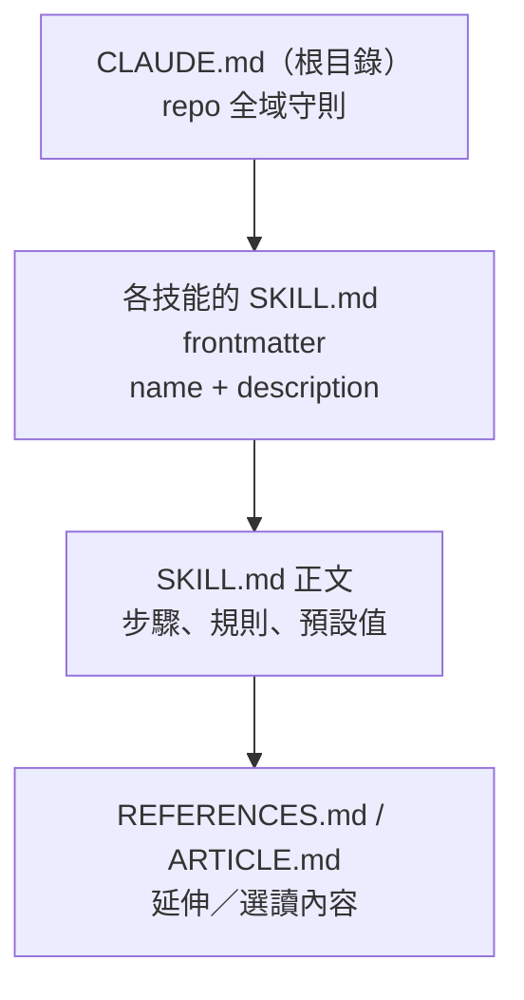

# 設定與環境（置換版：技能撰寫與資料夾契約規範）

⚠️ 本 repo 無傳統意義的「執行期設定」（無 env vars 驅動應用程式行為、無 config file 決定 runtime 參數）。取而代之，「設定」的等價概念是**撰寫技能時必須遵守的結構與風格規範**，其優先順序如下。

## 規範優先順序

1. **`CLAUDE.md`（`CLAUDE.md:1-40`）—— 最高層規範**，定義：
   - 資料夾契約（`CLAUDE.md:12-19`）
   - 撰寫風格（`CLAUDE.md:21-24`：像 Meng To 一樣寫——skimmable、practical、confident；偏好 constraints 與 defaults）
   - 安全守則（`CLAUDE.md:26-28`：不放 secrets/API keys/tokens、不貼私人客戶資訊）
   - 建議工作流程（`CLAUDE.md:30-34`）

2. **Frontmatter（`name` + `description`）—— 技能的「metadata schema」**，是 95 個 `SKILL.md` 唯一一致遵守的結構化欄位。`description` 欄位事實上承擔了「路由設定」的角色（見 `entry_points.md`），其撰寫品質直接決定該技能能否被正確觸發。

3. **技能正文的內建「設定值」**：部分技能把可調參數直接寫死在正文中，扮演類似 config default 的角色，例如 `agent-skills/ui/design-taste-frontend/SKILL.md:5-7` 的 `DESIGN_VARIANCE` / `MOTION_INTENSITY` / `VISUAL_DENSITY` 三個數值旋鈕，並註明「Do not ask the user to edit this file... adapt these values dynamically based on what they explicitly request」——即「有預設值，但執行期可被使用者請求覆寫」，等價於傳統系統的 `env var > default` 優先順序。

4. **`REFERENCES.md` / `ARTICLE.md`**：選讀層，`CLAUDE.md:22` 規定 `REFERENCES.md` 只能是連結（"links only (no big explanations)"），確保核心指令與延伸閱讀分離，避免 `SKILL.md` 過度膨脹。

## Secrets 管理方式

沒有 secrets 直接進到 repo（見 `integrations.md` 的 ElevenLabs 案例）。所有需要憑證的技能都指示 agent 在**執行環境**（環境變數、`.env`、外部 JSON config）中尋找機密資訊，repo 本身保持零機密狀態，符合其「公開開源、可攜式分享」的定位。

## Feature Flags 的等價物

沒有傳統 feature flag 系統。最接近的等價概念是技能正文中的「數值旋鈕」（如上述 `DESIGN_VARIANCE`）與部分技能標記的 `[MANDATORY]` / `[CRITICAL]` 強制規則——這些是寫在文字裡、由 agent 在生成時「執行」的軟性開關，而非程式碼中可程式化查詢的旗標。
