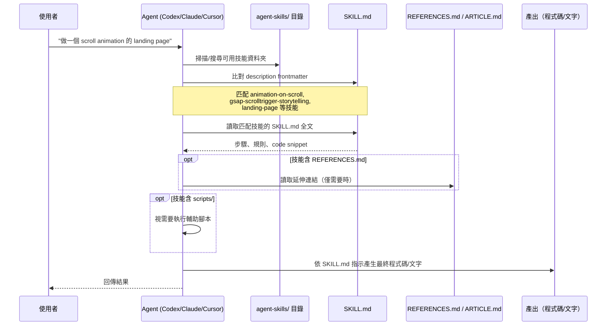

# 技能載入與消費流程（置換 Request/Data Flow）

代表性 use case：**一個 agent 收到「幫我做一個有 scroll-triggered 動畫的 landing page」的請求，如何從 repo 找到並套用正確技能到輸出結果。**

## 端到端流程

## 每一層的轉換

1. **Routing（技能匹配）**：Agent 讀取使用者意圖關鍵字，與 `agent-skills/**/SKILL.md` 的 `description` frontmatter 做語意比對。可能同時匹配多個技能（如上例會匹配 `animation-on-scroll/`、`gsap-scrolltrigger-storytelling/`、`landing-page/`），此時由 agent 自行判斷疊加使用。

2. **Validation（無強制 schema）**：⚠️ 未驗證——目前無自動化工具驗證 `SKILL.md` 是否符合 `CLAUDE.md` 定義的資料夾契約（frontmatter 必要欄位、檔名規範）。驗證完全依賴人工 review 與 agent 自身的容錯解讀。

3. **Business logic（技能內容套用）**：技能本體（`SKILL.md` 正文）提供具體規則、預設值、code snippet。例如 `agent-skills/web-design/animation-on-scroll/SKILL.md` 提供 IntersectionObserver 的具體實作模式；agent 直接複製/改寫這些 snippet 到輸出中。

4. **Persistence（本 repo 無資料庫，等價概念是「技能被複製到下游專案」）**：技能的效果不會寫回本 repo，而是體現在使用該技能的**下游專案**程式碼中。本 repo 本身是唯讀的知識來源。

5. **Response（最終輸出）**：Agent 產出程式碼/文字回應使用者，通常不會逐字引用 `SKILL.md`，而是內化其規則後生成客製化結果。

## 附加輔助技能腳本的資料流（少數技能）

部分 `codex/` 技能提供可執行腳本，資料流略有不同：
- `agent-skills/codex/stitched-full-page-capture/scripts/stitch_full_page_capture.mjs`：接收頁面截圖片段 → 拼接成完整長截圖 → 輸出圖片檔供後續技能（如 `video-to-superprompt`）消費
- `agent-skills/codex/elevenlabs-tts/scripts/generate_voice.py`：讀取文字腳本 + 本地 voice profile JSON（非本 repo 內，避免存放帳號私密資訊，見 `agent-skills/codex/elevenlabs-tts/SKILL.md:7-10`）→ 呼叫 ElevenLabs API → 輸出音檔

這類技能形成小型 pipeline：**擷取 → 處理 → 交給下一個技能**，是 repo 內少數具備「資料轉換」性質的部分。
